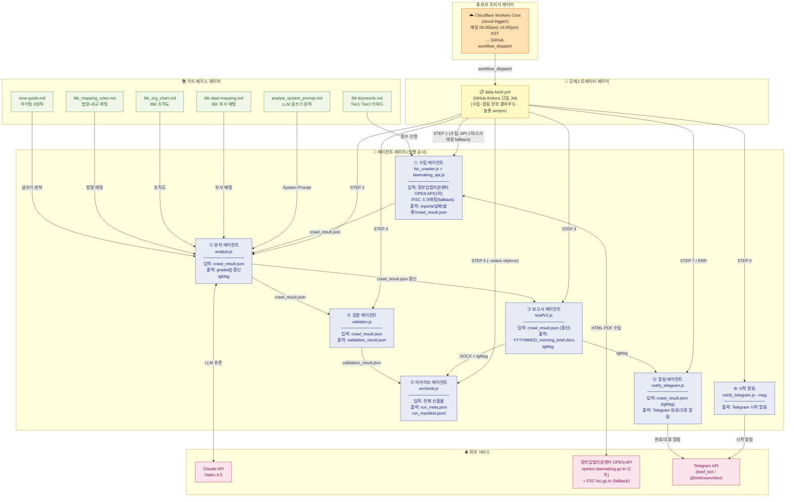
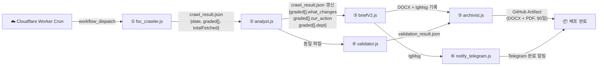

# 에이전트 조직도

> 단일 GitHub Actions Job을 구성하는 6개 클라우드 에이전트의 역할, 위계, 데이터 인계 관계
> (완전 클라우드 — 로컬 PC 불필요)

---

## 에이전트 계층도



---

## 실행 트리거 (완전 클라우드)

| 항목 | 내용 |
|---|---|
| 정시 트리거 | 외부 Cloudflare Workers Cron (`cloud-trigger/`) — 매일 **06:00(am)·16:00(pm) KST** (UTC `0 21`·`0 7`) |
| 트리거 방식 | GitHub `workflow_dispatch` 호출 (발화시각으로 슬롯 am/pm 자동판별) |
| 백업 | GitHub schedule cron (지연·누락 잦음 → 백업용) |
| 수동 | `gh workflow run "IBK Morning Brief" --ref main` |
| 워크플로우 | `.github/workflows/daily-brief.yml` (단일 Job) |

> 수집은 정부입법지원센터 OPEN API 1차 + FSC 스크래핑 fallback(진행중 예고만)으로 클라우드에서 실행한다.
> ⚠️ 단, 러너 IP→한국 정부망 직결이 timeout(egress)이나 KR 경유 프록시(Vercel 서울 icn1)로 해결·검증 완료(2026-06-30, `docs/egress_해결제안_KR프록시_20260630.md`).
> 과거의 로컬 `telegram_listener.js`·`trigger_bot`(EXECUTE 릴레이)·공유 그룹·`run_pipeline.vbs`·카카오 알림은 모두 폐지(은퇴).

---

## 에이전트별 상세 명세

### ⓪ notify_telegram.js — 시작 알림 (STEP 0)

**위치:** GitHub Actions (ubuntu-latest)

| 항목 | 내용 |
|---|---|
| 런타임 | Node.js |
| 동작 | `--msg "⚙️ {DATE} 브리핑 생성 시작합니다."` |
| 출력 | Telegram 시작 알림 |

---

### ① fsc_crawler.js — 수집 에이전트 (STEP 1)

**위치:** GitHub Actions (ubuntu-latest) — 클라우드 직접 실행 (한국 IP 불필요)

| 항목 | 내용 |
|---|---|
| 런타임 | Node.js (CommonJS) |
| 입력 | FSC 입법예고 목록 페이지 (HTTP GET) |
| 출력 | `reports/DATE/crawl_result.json`, `reports/DATE/pdfs/*.pdf` |
| 실행 주체 | daily-brief.yml (워크플로우 직접 호출) |
| 재시도 | 최대 3회 재시도 |
| 실패 처리 | HTML 실패 → PDF fallback → 통합입법예고센터 fallback |

**핵심 알고리즘 — 점수 산정:**
```
score = Tier1 키워드 (+3) + Tier2 키워드 (+1) + D-14이내 (+2) + D-30이내 (+1)
등급: 상(score≥4 🔴) / 중(score≥2 🔶) / 하(score≥1 🔹) / 미해당(score=0, 제외)
```

---

### ② analyst.js — 분석 에이전트 (STEP 2)

**위치:** GitHub Actions (ubuntu-latest)

| 항목 | 내용 |
|---|---|
| 런타임 | Node.js (ES Module) |
| 모델 | claude-haiku-4-5-20251001 |
| 입력 | crawl_result.json (graded 배열) |
| 출력 | crawl_result.json 갱신 (what_changes, our_action, dept, tgMsg 등) |
| 처리 방식 | 순차 처리, 항목 간 300ms 지연 |
| 종료 코드 | 0=정상 / 1=fallback / 2=치명중단 |
| fallback | API 키 없거나 오류 시 키워드 기반 템플릿으로 대체 |

**LLM이 생성하는 필드:**

| 필드 | 제약 |
|---|---|
| `what_changes[]` | 35자 이하, 최대 2개, "~바뀌어요" 형태 |
| `our_action[]` | 60자 이하, 최대 3개, "[부서명] 담당자라면 ~" 형태 |
| `ctrl_insight` | 40자 이하, 부서명 + 구체 업무 포함 |
| `dept` | IBK 공식 조직도 부서명 1개 |
| `tg_key` | 18자 이하, 법령 약칭 |
| `term` | 신입 담당자 대상 용어 해설 1개 |

---

### ③ briefV2.js — 보고서 에이전트 (STEP 3)

**위치:** GitHub Actions (ubuntu-latest)

| 항목 | 내용 |
|---|---|
| 런타임 | Node.js (ES Module, docx 라이브러리) |
| 입력 | crawl_result.json (analyst 갱신 후) |
| 출력 | `reports/DATE/{slot}/DATE_{morning\|afternoon}_brief.docx` + crawl_result.json 에 `tgMsg` 기록 |
| 레이아웃 기준 | docs/SKILL.md v2.4 (뉴스레터형, briefV2.js 실측) |

**뉴스레터형 섹션 (고정 2 + 조건부 5):**

| 섹션 | 출력 조건 | 내용 |
|---|---|---|
| 🌞 헤더 | 항상 | 날짜 + "아침에 읽는 규제 변화" |
| 요약 오프닝 | 항상 | 신규 N건·즉시검토 M건 (graded 0건이면 "없었어요" 안내) |
| 🔴 즉시검토 카드 | 상(score≥4) 존재 | 최대 2건, 뭐가 바뀌나요?/왜 중요한가요?/할 일 |
| 🔹 그 외 오늘 체크할 법령 | 위 2건 외 존재 | 🔶/🔹 한 줄 카드 |
| 📅 이번 주 마감 요약 | graded≥3 & D-7≤2건 | D-7 이내 최대 3건 |
| 📖 오늘의 용어 | term 존재 | 용어 1개 해설 |
| 오늘 하나만 기억하세요 | graded≥1 | 마무리 한 줄 |

---

### ④ validator.js — 검증 에이전트 (STEP 4)

**위치:** GitHub Actions (ubuntu-latest)

| 항목 | 내용 |
|---|---|
| 런타임 | Node.js (ES Module) |
| 입력 | crawl_result.json |
| 출력 | `reports/DATE/validation_result.json` |
| 종료 코드 | 0=통과 / 1=경고(계속) / 2=오류 |

**10개 검증 항목:**

| 코드 | 항목 | 기준 |
|---|---|---|
| A1 | what_changes 존재 | 1건 이상 |
| A2 | our_action 길이 | 60자 이하 |
| A3 | ctrl_insight 존재 | 비어있지 않음 |
| A4 | dept 정확성 | IBK 공식 부서명 |
| B1 | what_changes 최소 길이 | 15자 이상 |
| B2 | 하등급 our_action | 비어있어도 INFO |
| C1 | Telegram 글자 수 | 200자 이하 |
| C2 | Telegram 줄 수 | 5줄 이하 |
| C3 | Telegram 줄1 패턴 | 🔔 포함 |
| C4 | Telegram 줄2 패턴 | 소관부처 포함 |

---

### ⑤ archivist.js — 아카이브 에이전트 (STEP 5)

**위치:** GitHub Actions (ubuntu-latest), `--status {ok|error}`

| 항목 | 내용 |
|---|---|
| 런타임 | Node.js (ES Module) |
| 입력 | 전체 산출물 (DOCX, JSON, 로그) |
| 출력 | run_meta.json, run_manifest.jsonl 누적 |
| 보관 정책 | DOCX 90일 / JSON 30일 / 로그 14일 |

---

### ⑥ notify_telegram.js — 알림 에이전트 (STEP 7 / ERR)

**위치:** GitHub Actions (ubuntu-latest)

| 항목 | 내용 |
|---|---|
| 런타임 | Node.js |
| 메신저 | Telegram (봇 1개 — brief_bot / @briefcoworkbot) |
| 완료 알림 | `--from-crawl-result` — crawl_result.json 의 `tgMsg` 발송 |
| 오류 알림 | 워크플로우 `if: failure()` → `--msg "❌ 브리핑 오류 발생 ({DATE})..."` |
| 출력 | Telegram 완료/오류 알림 |

---

## 에이전트 간 데이터 인계 요약



---

_last updated: 2026-06-26_
