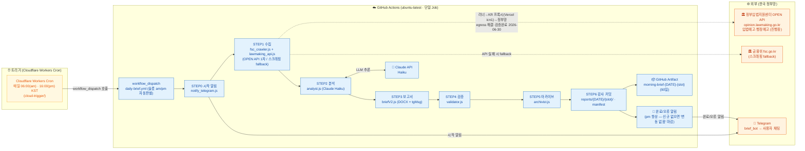
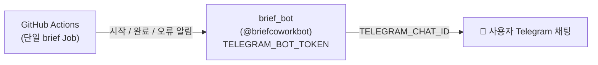
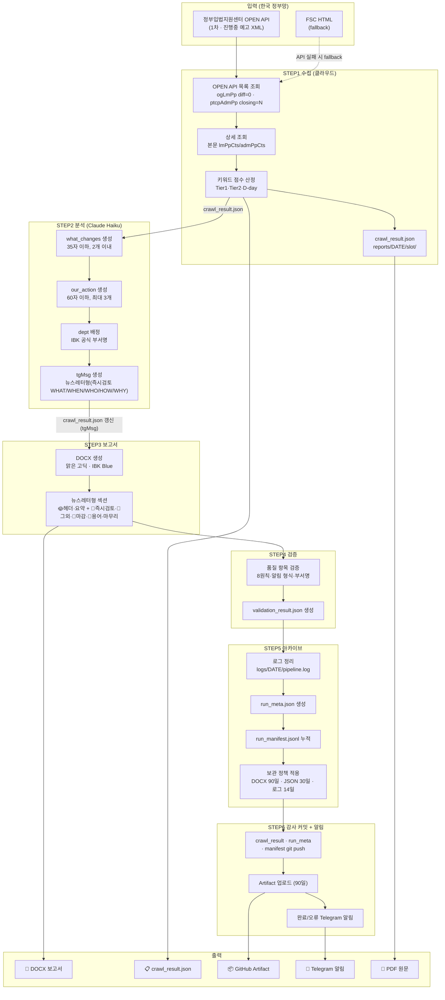

# 시스템 아키텍처

> IBK 아침 규제 브리핑 파이프라인 — 전체 구조 및 데이터 흐름
> **완전 클라우드 자동화 — 로컬 PC 불필요**

---

## 전체 아키텍처 개요

전 과정이 클라우드(Cloudflare Workers + GitHub Actions)에서 실행되며 로컬 PC는 필요하지 않다.
수집·분석·보고서·검증·아카이브·알림이 **단일 GitHub Actions Job** 안에서 순차 실행되고,
산출물은 **런별 슬롯(am/pm)** 으로 `reports/{DATE}/{slot}/` 에 분리 보존된다.
> ⚠️ 단, **GitHub 러너 IP → 한국 정부망(OPEN API·FSC) 직결은 timeout(egress)** 이나, **KR 경유 프록시(Vercel 서울 icn1)로 해결·운영 검증 완료**(2026-06-30 · `docs/egress_해결제안_KR프록시_20260630.md`). 러너→프록시→API 경로로 정시 런 정상(57초 성공).

---

## 구성 요소별 역할

### 트리거 (Cloudflare Workers Cron)

| 구성 요소 | 역할 |
|---|---|
| Cloudflare Workers Cron (`cloud-trigger/`) | 매일 **06:00(am)·16:00(pm) KST**에 GitHub `workflow_dispatch` 호출 (UTC cron `0 21 * * *` + `0 7 * * *`). 발화시각으로 슬롯 자동판별 |

**왜 GitHub 자체 schedule cron이 아닌가?**
GitHub Actions의 schedule cron은 최대 약 12시간의 지연·누락이 확인되어 **제거**했다. 정시성은 외부 Cloudflare Workers Cron이 책임진다. (GitHub schedule cron 백업이 필요할 경우에 한해 보조 수단으로만 고려.)
수동 실행은 `gh workflow run "IBK Morning Brief" --ref main`.

---

### 클라우드 파이프라인 (GitHub Actions · 단일 Job)

`.github/workflows/daily-brief.yml`, `ubuntu-latest`, 단일 `brief` Job. `on: workflow_dispatch` 트리거.

| STEP | 구성 요소 | 역할 |
|---|---|---|
| STEP 0 | `notify_telegram.js --msg` | 시작 알림 (Telegram) |
| STEP 1 | `fsc_crawler.js` (+`lawmaking_api.js`) | **수집: 정부입법지원센터 OPEN API 1차(진행중만) / FSC 스크래핑 fallback**, `reports/{DATE}/{slot}/crawl_result.json` 생성. timeout/error 대비 **최대 3회 재시도** |
| STEP 2 | `analyst.js` | Claude Haiku LLM 분석 (graded[] + tgMsg). exit 0=정상 / 1=fallback / 2=치명중단 |
| STEP 3 | `briefV2.js` | DOCX 보고서 생성 + `tgMsg` 기록 |
| STEP 4 | `validator.js` | 품질 검증 (validation_result.json) |
| STEP 5 | `archivist.js` | 로그 정리·메타 기록·보관 정책 적용 |
| STEP 6 | 감사 커밋 | `reports/{DATE}/{slot}/`(crawl_result·run_meta)·`run_manifest.jsonl` git 커밋·push |
| — | Artifact 업로드 | `reports/{DATE}/{slot}/` → `morning-brief-{DATE}-{slot}` (90일) |
| — | 완료/오류 알림 | `notify_telegram.js` (Telegram · **pm 완료 알림 항상** — 신규 있으면 [오후 추가] 전체, 없으면 "오전 대비 변동 없음" 마감) |

**수집 방식 (1차 OPEN API / 2차 스크래핑):**
1차로 **정부입법지원센터 OPEN API**(`opinion.lawmaking.go.kr` — 입법예고 `ogLmPp?cptOfiOrgCd=1160100&diff=0`, 행정예고 `ptcpAdmPp?asndOfiNm=금융위원회&closing=N`)에서 **진행중(active) 예고만** 구조화 데이터로 수집한다(사전 대응 목적 — 완료 예고 제외). 인증은 `OC`=아이디(키 불요). API 실패 시 **FSC HTML 스크래핑 fallback**으로 전환한다.

> ⚠️ **egress 제약(해결됨):** GitHub 러너 IP에서 한국 정부망(OPEN API·FSC 공통)으로의 직결은 timeout 된다(특정 IP대역 차단/라우팅 추정). 같은 API가 다른 출구(WebFetch·서울 함수)에서는 정상 → **데이터소스 문제가 아니라 네트워크 출구(egress) 문제**. **KR 경유 프록시(Vercel 서울 icn1)로 해결·운영 검증 완료**(2026-06-30, 러너→프록시→API 57초 성공 · `docs/egress_해결제안_KR프록시_20260630.md`).

**수집 실패 처리:**
수집이 timeout/error로 최종 실패하면 "IBK 영향 없음"으로 오인 보고하지 않는다. `failure_meta.json`만 기록(기존 성공본 미훼손)하고 **"❌ 수집 실패"** 알림 후 Job을 실패(`exit 1`)로 중단한다.

> 과거에는 로컬 listener(`telegram_listener.js`)가 한국 IP에서 크롤하고 git push로 분석 Job을 트리거하는 2-Job 구조였으나 **폐지**되었다. 이후 클라우드 직결을 시도했으나 위 egress 제약이 드러나 **KR 프록시로 보완·운영 중**이다(정식 운영 배포 → `vercel-kr-crawl/README.md`).

---

### 외부 서비스

| 서비스 | 용도 |
|---|---|
| 정부입법지원센터 OPEN API (opinion.lawmaking.go.kr) | **1차 수집** — 입법예고·행정예고 진행중 구조화 데이터 (OC 인증, 키 불요) |
| 금융위원회 fsc.go.kr | **2차(fallback)** — HTML 스크래핑 |
| Telegram API | 시작·완료·오류 알림 발송 (단일 봇) |
| Anthropic Claude API | Haiku LLM 추론 (analyst.js) |
| KR 프록시 (Vercel icn1, **운영**) | 러너→한국정부망 egress 우회 중계 (Git연동 자동 재배포 · `vercel-kr-crawl/`) |

---

## Telegram 알림 구조 (단일 봇)

봇은 **1개**(`brief_bot` / `@briefcoworkbot`)만 사용한다. 동일 봇이 시작 알림(STEP 0)·완료 알림(`--from-crawl-result`)·오류 알림을 사용자 채팅(`TELEGRAM_CHAT_ID`)으로 발송한다. 알림 메시지 본문 필드명은 **`tgMsg`**이며 `crawl_result.json`에 기록된다.

> 과거의 이중 봇 구조(trigger_bot `@brief_trigger_bot`의 EXECUTE 릴레이 + 공유 그룹 폴링)와 로컬 listener는 **폐지**되었다.

---

## 데이터 흐름 상세

---

## 환경 변수 및 Secrets

### GitHub Actions Secrets (3개)

| Secret | 용도 |
|---|---|
| `ANTHROPIC_API_KEY` | Claude Haiku API 키 (analyst.js) |
| `TELEGRAM_BOT_TOKEN` | brief_bot 토큰 (시작·완료·오류 알림 발송) |
| `TELEGRAM_CHAT_ID` | 사용자 Telegram 채팅 ID (알림 수신) |

Cloudflare Workers Cron의 트리거 토큰 등은 `cloud-trigger/` 측에서 별도 관리된다.

---

## 알려진 제약사항

| 제약 | 원인 | 대응 |
|---|---|---|
| GitHub schedule cron 정시성 부족 | 최대 ~12h 지연·누락 | Cloudflare Workers Cron으로 06:00·16:00 KST 트리거 |
| **러너→한국정부망 egress 차단** ✅해결·운영화 | GitHub 러너 IP대역에서 OPEN API·FSC 직결 timeout(특정 대역 차단/라우팅) | **KR 경유 프록시(Vercel 서울 icn1)로 우회 — 정식 운영 배포**(2026-06-30 검증). 2026-07-01 프록시 404(Root Directory 오설정) 규명·교정으로 재발방지 완료. 잔여=가용성 SPOF(선택 강화, 고정 IP) |
| 수집 timeout | 위 egress + 외부 응답 지연 | STEP1 최대 3회 재시도, 최종 실패 시 "❌ 수집 실패" 알림 + Job 실패(failure_meta 격리) |
| DOCX git 추적 불가 | 보관/용량 정책 | GitHub Artifact(90일) 다운로드 방식으로 제공 |

---

_last updated: 2026-06-30 (수집=OPEN API 1차/스크래핑 fallback, 06:00·16:00 슬롯, egress 제약 반영)_
