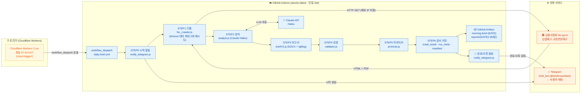
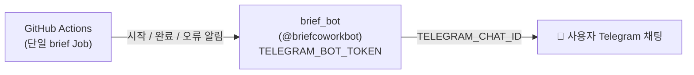
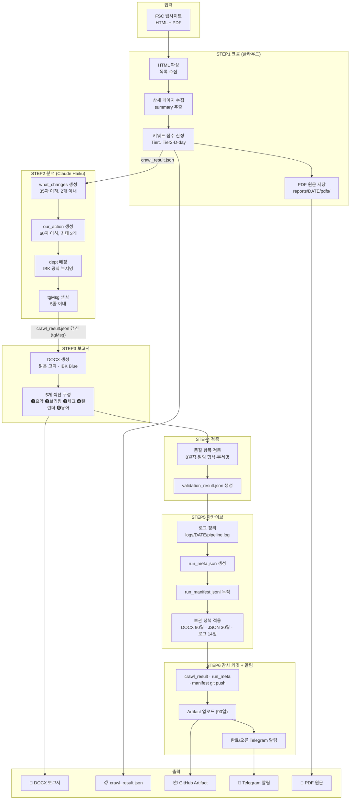

# 시스템 아키텍처

> IBK 아침 규제 브리핑 파이프라인 — 전체 구조 및 데이터 흐름
> **완전 클라우드 자동화 — 로컬 PC 불필요**

---

## 전체 아키텍처 개요

전 과정이 클라우드(Cloudflare Workers + GitHub Actions)에서 실행되며 로컬 PC는 필요하지 않다.
크롤·분석·보고서·검증·아카이브·알림이 **단일 GitHub Actions Job** 안에서 순차 실행된다.

---

## 구성 요소별 역할

### 트리거 (Cloudflare Workers Cron)

| 구성 요소 | 역할 |
|---|---|
| Cloudflare Workers Cron (`cloud-trigger/`) | 평일 07:30 KST에 GitHub `workflow_dispatch`를 호출해 파이프라인을 시작 |

**왜 GitHub 자체 schedule cron이 아닌가?**
GitHub Actions의 schedule cron은 최대 약 12시간의 지연·누락이 확인되어 **제거**했다. 정시성은 외부 Cloudflare Workers Cron이 책임진다. (GitHub schedule cron 백업이 필요할 경우에 한해 보조 수단으로만 고려.)
수동 실행은 `gh workflow run "IBK Morning Brief" --ref main`.

---

### 클라우드 파이프라인 (GitHub Actions · 단일 Job)

`.github/workflows/daily-brief.yml`, `ubuntu-latest`, 단일 `brief` Job. `on: workflow_dispatch` 트리거.

| STEP | 구성 요소 | 역할 |
|---|---|---|
| STEP 0 | `notify_telegram.js --msg` | 시작 알림 (Telegram) |
| STEP 1 | `fsc_crawler.js` | FSC 입법예고 크롤, PDF 원문 저장, `crawl_result.json` 생성. timeout/error 대비 **최대 3회 재시도** |
| STEP 2 | `analyst.js` | Claude Haiku LLM 분석 (graded[] + tgMsg). exit 0=정상 / 1=fallback / 2=치명중단 |
| STEP 3 | `briefV2.js` | DOCX 보고서 생성 + `tgMsg` 기록 |
| STEP 4 | `validator.js` | 품질 검증 (validation_result.json) |
| STEP 5 | `archivist.js` | 로그 정리·메타 기록·보관 정책 적용 |
| STEP 6 | 감사 커밋 | `crawl_result.json`·`run_meta.json`·`run_manifest.jsonl` git 커밋·push |
| — | Artifact 업로드 | `reports/{DATE}/` → `morning-brief-{DATE}` (90일) |
| — | 완료/오류 알림 | `notify_telegram.js` (Telegram) |

**왜 크롤까지 클라우드에서 실행하는가?**
금융위원회(fsc.go.kr)가 해외 IP를 차단하지 않음이 검증되었다(미국 소재 GitHub 러너에서 크롤 정상). 따라서 크롤도 클라우드에서 직접 실행하며 한국 IP의 로컬 PC가 필요하지 않다.

**크롤 실패 처리:**
크롤이 timeout/error로 최종 실패하면 "IBK 영향 없음"으로 오인 보고하지 않는다. `crawl_result.json`의 `error` 필드가 있으면 **"❌ 크롤 실패"** 알림을 발송하고 Job을 실패(`exit 1`)로 중단한다.

> 과거에는 로컬 listener(`telegram_listener.js`)가 한국 IP에서 크롤하고 git push로 분석 Job을 트리거하는 2-Job 구조였으나, FSC 해외 IP 허용이 검증되며 **폐지**되었다.

---

### 외부 서비스

| 서비스 | 용도 |
|---|---|
| 금융위원회 fsc.go.kr | 입법예고·규정변경예고 HTML + PDF 원문 |
| Telegram API | 시작·완료·오류 알림 발송 (단일 봇) |
| Anthropic Claude API | Haiku LLM 추론 (analyst.js) |

---

## Telegram 알림 구조 (단일 봇)

봇은 **1개**(`brief_bot` / `@briefcoworkbot`)만 사용한다. 동일 봇이 시작 알림(STEP 0)·완료 알림(`--from-crawl-result`)·오류 알림을 사용자 채팅(`TELEGRAM_CHAT_ID`)으로 발송한다. 알림 메시지 본문 필드명은 **`tgMsg`**이며 `crawl_result.json`에 기록된다.

> 과거의 이중 봇 구조(trigger_bot `@brief_trigger_bot`의 EXECUTE 릴레이 + 공유 그룹 폴링)와 로컬 listener는 **폐지**되었다.

---

## 데이터 흐름 상세

---

## 환경 변수 및 Secrets

### GitHub Actions Secrets (3개)

| Secret | 용도 |
|---|---|
| `ANTHROPIC_API_KEY` | Claude Haiku API 키 (analyst.js) |
| `TELEGRAM_BOT_TOKEN` | brief_bot 토큰 (시작·완료·오류 알림 발송) |
| `TELEGRAM_CHAT_ID` | 사용자 Telegram 채팅 ID (알림 수신) |

Cloudflare Workers Cron의 트리거 토큰 등은 `cloud-trigger/` 측에서 별도 관리된다.

---

## 알려진 제약사항

| 제약 | 원인 | 대응 |
|---|---|---|
| GitHub schedule cron 정시성 부족 | 최대 ~12h 지연·누락 | Cloudflare Workers Cron으로 07:30 KST 트리거 |
| FSC 크롤 timeout | 외부 사이트 응답 지연 | STEP1 최대 3회 재시도, 최종 실패 시 "❌ 크롤 실패" 알림 + Job 실패 |
| DOCX git 추적 불가 | 보관/용량 정책 | GitHub Artifact(90일) 다운로드 방식으로 제공 |

---

_last updated: 2026-06-26_
