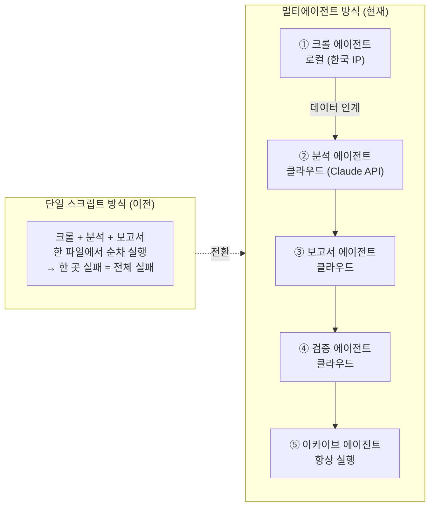

# 방법론

> IBK 아침 규제 브리핑 파이프라인 — 설계 철학 및 글쓰기 원칙

---

## 1. 왜 멀티에이전트 아키텍처인가

### 단일 스크립트 방식의 한계

초기에는 크롤 → 분석 → 보고서 생성을 하나의 스크립트에서 처리했다. 다음 문제가 반복됐다.

| 문제 | 영향 |
|---|---|
| 한 단계 실패가 전체 중단 | 크롤 성공해도 분석 오류 시 보고서 없음 |
| 코드 수정 시 전체 재검증 필요 | 유지보수 비용 급증 |
| LLM 응답 품질 모니터링 불가 | 잘못된 부서명·어미 오류 방치 |
| 로컬 실행만 가능 | PC 꺼져 있으면 파이프라인 중단 |

### 멀티에이전트로 해결한 것



**멀티에이전트 방식의 이점:**

| 항목 | 내용 |
|---|---|
| 장애 격리 | 분석 에이전트가 실패해도 fallback 모드로 계속 진행 |
| 독립 배포 | 각 에이전트를 개별 수정·재실행 가능 |
| 관심사 분리 | 수집·분석·보고서·검증·아카이브가 각자의 책임만 가짐 |
| 실행 환경 분리 | 크롤링(로컬 한국 IP) ↔ 분석(GitHub Actions 클라우드) |
| LLM 품질 관리 | validator.js가 LLM 출력을 별도 검증 |

### 로컬 + 클라우드 하이브리드를 선택한 이유

```
문제: FSC(금융위원회) 웹사이트는 해외 IP를 차단한다
      GitHub Actions 러너는 미국 소재 → 직접 크롤 불가

해결: 크롤링만 로컬 PC에서 수행 (한국 IP)
      crawl_result.json을 git push → GitHub Actions가 이어받음
      분석·보고서·아카이브는 항상 켜져 있는 클라우드에서 실행
```

---

## 2. 글쓰기 프레임워크

### Amazon "Working Backwards" 원칙

아마존이 제품 개발 시 사용하는 "고객 입장에서 역방향 설계" 방식을 글쓰기에 적용했다.

**전통적 보고서 방식 (지양):**
```
1. 법령명 및 개정 배경 설명
2. 주요 개정 내용 나열
3. 시행일 안내
4. 참고 사항
→ 담당자는 끝까지 읽어야 "내가 뭘 해야 하는지" 파악 가능
```

**Working Backwards 방식 (채택):**
```
1. [부서명] 담당자라면 오늘 [행동]을 확인해야 해요  ← 결론 먼저
2. 왜냐면 [구체 이유]
3. 변경 내용은 [핵심 2가지]
4. 기한: [D-N일]
→ 첫 줄만 읽어도 "내가 오늘 뭘 해야 하는지" 파악 가능
```

### Axios "Smart Brevity" 원칙

뉴스레터 Axios의 기사 작성 원칙을 법령 브리핑에 적용했다.

**3-파트 구조:**

| 파트 | 내용 | 분량 |
|---|---|---|
| 뭐가 바뀌나요? (what_changes) | 핵심 변화 2가지, "~바뀌어요" | 35자 이하, 2개 이내 |
| 왜 중요한가요? (ctrl_insight) | IBK 구체 업무 영향 | 40자 이하, 1문장 |
| 할 일 (our_action) | 부서별 제안형 액션 | 60자 이하, 최대 3개 |

**등급별 분량 차등 적용:**

| 등급 | 구조 | 분량 |
|---|---|---|
| 🔴 즉시 (score≥4) | 풀 구조 (3파트 + 세부 설명) | 5~6줄 |
| 🔶 중간 (score≥2) | 핵심 요약 | 2줄 |
| 🔹 참고 (score≥1) | 한 줄 요약 | 1줄 |

---

## 3. 토스뱅크 스타일 한국어 어조 가이드

### 기준 예시

> "여신기획부 담당자라면 이번 여신금리 산정 개정안 꼭 확인해 보세요.  
> 대출금리를 산정할 때 기준금리·가산금리를 나눠서 고객에게 알려줘야 해요."

이 예시가 모든 원칙의 기준이다. 어색하면 이 예시와 비교한다.

---

### 8개 원칙 요약

| # | 원칙 | 핵심 |
|---|---|---|
| 1 | 핵심을 먼저 쓴다 | 결론 → 이유 → 배경 순서 |
| 2 | 짧은 문장을 쓴다 | 한 문장 = 한 사실, 30자 이하 목표 |
| 3 | 쉬운 단어를 선택한다 | 법령 원문 그대로 옮기지 않음 |
| 4 | 독자를 주어로, 제안형으로 | "[부서명] 담당자라면 ~꼭 확인해 보세요" |
| 5 | 불필요한 단어를 뺀다 | "이에 따라", "상기와 같이" 등 제거 |
| 6 | 숫자와 날짜는 구체적으로 | "조만간" → "2026.07.01 (D-21)" |
| 7 | 액션은 동사로 끝낸다 | "~확인해 보세요" (명사형 종결 금지) |
| 8 | 친근하되 핵심은 명확하게 | "~할 수 있어요" 추측형 금지 |

---

### 강요형 vs 제안형 어미 대조

| ❌ 강요형 (금지) | ✅ 제안형 (사용) |
|---|---|
| ~해야 합니다 | ~꼭 확인해 보세요 |
| ~하여야 합니다 | ~해 보세요 |
| 검토가 필요합니다 | 한번 살펴보세요 |
| 시행이 요구됩니다 | 꼭 반영해 보세요 |
| 준수 의무가 있습니다 | ~에 주의가 필요해요 |
| 모니터링할 예정입니다 | (삭제) |

### 법령 용어 → 브리핑 용어 변환표

| 법령 원문 | 브리핑 표현 |
|---|---|
| 준수의무 부과 | ~해야 해요 |
| 이행 기한 도과 | 기한을 넘기면 |
| 내부통제기준 미비 | 내규에 빠진 항목 |
| 해당 법령 시행 이전 | 법이 바뀌기 전 |
| 조치 사항 이행 촉구 | 빨리 처리해야 해요 |
| 금융소비자보호 | 소비자 보호 |
| 건전성 규제 | 리스크 관리 규정 |

---

## 4. 하네스 엔지니어링 (Harness Engineering)

파이프라인의 신뢰성을 위해 각 에이전트마다 종료 코드 체계와 fallback 메커니즘을 설계했다.

### 종료 코드 체계

| 에이전트 | exitCode 0 | exitCode 1 | exitCode 2 |
|---|---|---|---|
| fsc_crawler.js | 정상 | — | 크롤 실패 → 파이프라인 중단 |
| analyst.js | 정상 | fallback 모드 (계속) | 치명 오류 → 중단 |
| briefV2.js | 정상 | — | DOCX 생성 실패 → 중단 |
| validator.js | 통과 | 경고 (계속) | 오류 → status=warn |
| archivist.js | 정상 | — | — (항상 성공으로 처리) |

### Fallback 계층 구조

```
fsc_crawler.js 실패 처리:
  1차: HTML 파싱 → summary 추출 (기본)
  2차: PDF 첨부파일 다운로드 → 텍스트 추출 (HTML 실패 시)
  3차: 통합입법예고센터 검색 (PDF 실패 시)
  최종: summary 원본 유지하고 계속 진행

analyst.js 실패 처리:
  1차: Claude API 추론 (ANTHROPIC_API_KEY 있을 때)
  2차: 키워드 기반 템플릿 생성 (API 오류 또는 키 없을 때)
  → exitCode=1로 파이프라인 계속 진행 (보고서는 생성됨)
```

### 검증 체계 (validator.js)

10개 항목을 3개 등급으로 분류해 자동 검증한다.

```
A등급 (심각): A1~A4 — 실패 시 status=error
B등급 (경고): B1~B2 — 실패 시 status=warn
C등급 (형식): C1~C4 — Telegram 메시지 포맷 검증
```

**LLM 출력 품질 관리:**  
Claude API가 생성한 필드(what_changes, our_action, dept)를 사람이 직접 검수하지 않고 코드로 자동 검증한다. 부서명 오류, 글자 수 초과, 형식 불일치를 자동 감지해 다음 날 프롬프트 개선에 활용한다.

---

## 5. 지식 베이스 분리 원칙

LLM 프롬프트와 비즈니스 지식을 코드에서 분리해 관리한다.

```
코드 (analyst.js)      → "어떻게 분석할 것인가" (불변)
지식 베이스 (knowledge/) → "무엇을 참고할 것인가" (자주 업데이트)
```

| 파일 | 내용 | 업데이트 주기 |
|---|---|---|
| `agents/analyst_system_prompt.md` | LLM 글쓰기 원칙 8가지 | 드물게 (원칙 변경 시) |
| `knowledge/ibk-dept-mapping.md` | IBK 공식 부서 매핑 | 조직 개편 시 |
| `knowledge/ibk_org_chart.md` | IBK 조직도 | 조직 개편 시 |
| `knowledge/ibk_mapping_rules.md` | 법령-내규 매핑 테이블 | 법령 개정 시 |
| `knowledge/ibk-keywords.md` | Tier1·Tier2 키워드 | 필요 시 추가 |
| `knowledge/tone-guide.md` | 라이팅 원칙 상세 | 드물게 |

**운영 원칙:** 지식 베이스 파일만 수정하면 analyst.js 재배포 없이 LLM 동작이 바뀐다. 코드 수정 없이 업무 로직을 관리할 수 있다.

---

## 6. 감사 대응 설계

IBK기업은행 내부통제점검팀의 특성상 감사 추적이 가능해야 한다.

| 감사 요구사항 | 설계 결정 |
|---|---|
| 분석 근거 보존 | crawl_result.json에 원문 URL + summary 포함 |
| PDF 원문 보관 | fsc_crawler.js가 reports/DATE/pdfs/ 에 항상 저장 |
| 실행 이력 추적 | run_manifest.jsonl에 모든 실행 기록 누적 |
| 보고서 버전 관리 | GitHub Artifacts에 90일 보관 |
| 파이프라인 로그 | archivist.js가 logs/DATE/pipeline.log 이동·보존 |
| 보관 정책 | DOCX 90일 · JSON 30일 · 로그 14일 자동 정리 |

---

_last updated: 2026-06-23_
