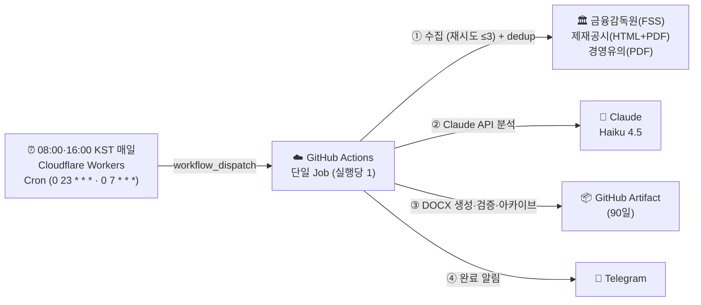

# 문서 지도 (정본 인덱스) — IBK FSS 제재·경영유의 브리핑

> IBK기업은행 내부통제점검팀 — 금융감독원(FSS) 제재공시·경영유의사항 자동 수집·분석·보고서 생성
> **이 문서가 저장소 문서의 허브(단일 진입점)입니다.** 아래 표에서 "알고 싶은 것"을 고르면 그 주제의 **정본 문서 하나**로 갑니다.

---

## 🧭 이걸 알고 싶다면 → 이 문서 하나

| 알고 싶은 것 | 정본 문서 | 대상 독자 |
|---|---|---|
| **이 프로젝트가 뭔지 30초 요약** | [../README.md](../README.md) (저장소 랜딩) | 처음 온 사람 |
| **왜/어떻게 설계됐나 (기획안·결정사항)** | [business/PROJECT_BRIEF.md](business/PROJECT_BRIEF.md) | 기획·설계 |
| **경영진 1‑페이지 보고** | [business/EXECUTIVE_BRIEF.md](business/EXECUTIVE_BRIEF.md) | C‑Level |
| **설계 철학·글쓰기(해요체) 원칙** | [business/METHODOLOGY.md](business/METHODOLOGY.md) | 기획·리뷰 |
| **AI 멀티에이전트로 일한다는 것(소개·내러티브)** | [business/AI_멀티에이전트로_일한다는것.md](business/AI_멀티에이전트로_일한다는것.md) | 경영진·일반·외부 |
| **전체 시스템 구조·데이터 흐름** | [technical/ARCHITECTURE.md](technical/ARCHITECTURE.md) | 개발 |
| **에이전트 6종 역할·입출력** | [technical/AGENT_ORG_CHART.md](technical/AGENT_ORG_CHART.md) | 개발 |
| **DOCX 보고서 레이아웃 실측값** | [technical/SKILL.md](technical/SKILL.md) | 개발 (수정 시 briefV2.js 동반) |
| **매일 어떻게 도는가 (실행 절차·오류 대응)** | [operations/workflow.md](operations/workflow.md) | 운영 |
| **공식 산출 문서 세트 (보고·인수인계·질의)** | [deliverables/](deliverables/01_SOD.md) — SOD·BRD·업무·기술·Q&A·개선사항 | 보고·인수인계 |
| **최근 개선사항(2026-07) — 무엇을·왜 바꿨나 (건별)** | [deliverables/06_개선사항_2026-07.md](deliverables/06_개선사항_2026-07.md) | 경영진·실무자 |
| **유사 아키텍처 프로젝트 교훈 체크리스트** | [history/LESSONS_LEARNED.md](history/LESSONS_LEARNED.md) | 아키텍트 (FSC 회고) |
| **개발·커밋 지침 (에이전트/기여자)** | [../CLAUDE.md](../CLAUDE.md) | 기여자 |
| **변경 이력** | [../CHANGELOG.md](../CHANGELOG.md) | 전체 |

> 코드가 런타임에 읽는 지식 파일(`knowledge/`·`agents/`)은 **문서가 아니라 파이프라인 입력**이라 이 지도에 넣지 않습니다. 그 정본 관계는 각 파일 상단과 [business/METHODOLOGY.md](business/METHODOLOGY.md)를 참조하세요.

---

## 📁 폴더 구조 (대상 독자별)

```
문서 루트
├── README.md              ← 저장소 랜딩 (프로젝트 30초 요약)
├── CLAUDE.md              ← 개발·커밋 지침 (에이전트/기여자용, 하네스가 읽음)
├── CHANGELOG.md           ← 변경 이력
├── workflow.md · SKILL.md · PROJECT_BRIEF.md   ← 포인터 stub (정본은 docs/ 아래)
└── docs/
    ├── README.md          ← 이 파일 (정본 지도)
    ├── business/          경영·기획·방법론
    │   ├── PROJECT_BRIEF.md
    │   ├── EXECUTIVE_BRIEF.md
    │   ├── METHODOLOGY.md
    │   └── AI_멀티에이전트로_일한다는것.md   ← 소개 내러티브(경영진·외부)
    ├── technical/         개발·구조·명세
    │   ├── ARCHITECTURE.md
    │   ├── AGENT_ORG_CHART.md
    │   └── SKILL.md
    ├── operations/        운영·실행 절차
    │   └── workflow.md    ← 워크플로우 단일 정본
    ├── deliverables/      공식 산출 문서 세트 (보고·인수인계·질의)
    │   ├── 01_SOD.md · 02_BRD.md · 03_BUSINESS_DOC.md
    │   ├── 04_TECH_DOC.md · 05_QNA.md
    │   └── 06_개선사항_2026-07.md   ← 최근 개선 건별(기술·업무)
    └── history/           이력·교훈
        └── LESSONS_LEARNED.md
```

---

## 🔒 정본 유지 원칙

1. **한 주제 = 정본 하나.** 같은 주제를 두 문서가 설명하지 않는다. 중복이 생기면 하나만 정본으로 남기고 나머지는 "정본은 여기" 포인터 stub으로 강등한다(옛 내용은 git 이력에 보존).
2. **대상 독자별 폴더.** business(경영·기획) / technical(개발) / operations(운영) / deliverables(공식 산출물) / history(이력·교훈). 새 문서는 독자 기준으로 배치한다.
3. **코드·설정·`knowledge/`·`agents/`는 문서 재편 대상이 아니다.** 코드가 읽는 파일은 이동·개명하지 않는다.
4. **수치·사양은 코드와 함께 갱신.** 예: `technical/SKILL.md`의 폰트 수치는 `briefV2.js` 변경과 같은 커밋에서 갱신한다.
5. **랜딩·지도·정본의 역할 분리.** 루트 `README.md`=랜딩, `docs/README.md`=지도, 각 주제 문서=정본. 서로를 가리키되 내용을 복제하지 않는다.

> **`business/` vs `deliverables/` 구분:** `business/`는 설계·방법론의 **리빙 레퍼런스**(왜/어떻게 만들었나), `deliverables/`는 보고·인수인계용 **공식 산출물 세트**(SOD·BRD·업무·기술·Q&A, 현행 스냅샷)이다.

---

## 한 줄 요약

매일 08:00 KST에 외부 Cloudflare Workers Cron이 GitHub Actions를 트리거하면, 단일 클라우드 Job이 금융감독원(FSS) 신규 제재공시·경영유의사항을 2소스에서 스크래핑(중복방지 원장 `state/seen_ids.json`과 대조)하고 Claude AI가 IBK 벤치마킹 관점으로 분석해, 자가점검 액션이 담긴 DOCX 보고서와 Telegram 알림을 생성하는 완전 클라우드 파이프라인이다. 산출물은 런별 슬롯(am/pm)으로 분리 보존한다. (로컬 PC 불필요)

> **사후 모니터링:** 타행·인접 금융회사의 실제 제재사례로 IBK 유사 취약점을 자가점검하고, IBK 직접 제재 시 즉시 대응한다. (법령 시행 전 예방 목적의 입법예고 브리핑과 구분)

---

## 아키텍처 요약



| 환경 | 역할 | 이유 |
|---|---|---|
| Cloudflare Workers Cron | 매일 08:00·16:00 KST 트리거 (`workflow_dispatch`, cron `0 23 * * *`·`0 7 * * *`). 08:00=am 전체 / 16:00=pm 델타 | GitHub schedule cron은 지연·누락이 잦음 |
| GitHub Actions (클라우드) | 수집·분석·보고서·검증·아카이브·알림 (단일 Job) | 24/7 안정 실행 · FSS 해외 IP 차단 없음 검증(미국 러너 PASS) → 프록시 불필요 |

단계별 상세·오류 대응은 [operations/workflow.md](operations/workflow.md), 구조는 [technical/ARCHITECTURE.md](technical/ARCHITECTURE.md)를 본다.

---

## 에이전트 구성

모든 단계는 GitHub Actions 단일 Job(클라우드)에서 순차 실행된다. 역할·입출력 상세는 [technical/AGENT_ORG_CHART.md](technical/AGENT_ORG_CHART.md).

| 순서 | 파일 | 역할 |
|---|---|---|
| ① | `fss_crawler.js` | 제재·경영유의 수집 — FSS 2소스 스크래핑(제재공시 HTML+PDF / 경영유의 PDF) + `state/seen_ids.json` 대조 dedup (최대 3회 재시도, 실패 격리) |
| ② | `analyst.js` | Claude API(Haiku 4.5)로 신규건만 LLM 분석 · Tier·위험도 판정 · 부서 배정 |
| ③ | `briefV2.js` | DOCX 보고서 생성 (맑은 고딕·IBK Blue) + Telegram 메시지(tgMsg) 구성 |
| ④ | `validator.js` | 품질 검증 |
| ⑤ | `archivist.js` | 감사 로그·메타데이터 아카이브 |

보조: `runslot.js`(am/pm 슬롯·경로 결정), `notify_telegram.js`(알림 발송).

---

## 중요도 체계 (Tier × 위험도)

제재 마감(D-day) 개념은 없다. 기관 계층 Tier와 위험도로 선별·정렬한다. 상세: `knowledge/fss_tier_methodology.md`.

| Tier | 대상 | 알림 | 보고서 |
|---|---|---|---|
| **T0** IBK직접 | 기업은행·IBK·중소기업은행 | ✅ | ✅ |
| **T1** 은행 | 시중·국책·지방·인터넷전문·외은지점 등 | ✅ | ✅ |
| **T2** 인접금융 | 금융지주·저축은행·보험·증권·카드·캐피탈 등 | ✅ | ✅ |
| **T3** 주변 | 대부업·환전영업소·소액송금·GA 등 | ❌ (헤더에 건수만 표기) | ✅ (하위 수록) |

---

## 빠른 시작 (최초 1회 설정)

완전 클라우드 운영이므로 평상시 로컬 작업은 필요 없다.

1. **요구사항** — GitHub CLI(`gh`, 수동 실행용) · Telegram 봇(FSS 전용 신규 봇) · Anthropic API 키 · Cloudflare Workers 계정(`cloud-trigger/`)
2. **GitHub Secrets (최초 1회)** — `ANTHROPIC_API_KEY` · `TELEGRAM_BOT_TOKEN` · `TELEGRAM_CHAT_ID`
3. **트리거 배포 (최초 1회)** — `cloud-trigger/`의 Cloudflare Workers Cron(`0 23 * * *`=08:00 am·`0 7 * * *`=16:00 pm, 대시보드에서 두 cron 등록)이 GitHub `workflow_dispatch` 호출. 배포는 `cloud-trigger/README.md` 참고.
4. **수동 실행** — `gh workflow run "IBK FSS Sanction Brief" --ref main`

절차·오류 대응 전체는 [operations/workflow.md](operations/workflow.md)를 따른다.

---

## 핵심 출력물

| 출력물 | 위치 | 보관 |
|---|---|---|
| DOCX 보고서 | `reports/DATE/{slot}/DATE_{morning\|afternoon}_brief.docx` | GitHub Artifact 90일 |
| PDF 원문 | `reports/DATE/{slot}/pdfs/*.pdf` | 감사·인적검증용 |
| 수집+분석 데이터 | `reports/DATE/{slot}/crawl_result.json` | git 추적 |
| 중복방지 원장 | `state/seen_ids.json` | git 커밋 (유일한 상태 저장소) |
| Telegram 알림 | 사용자 채팅(`TELEGRAM_CHAT_ID`) | 즉시 전달 |

---

_담당: IBK기업은행 내부통제점검팀_

_last updated: 2026-07-03 (오후 16:00 스케줄러 추가 — 하루 2회 발화 정합)_
