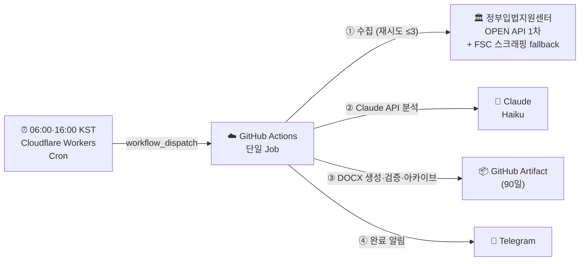

# IBK 아침 규제 브리핑 파이프라인

> IBK기업은행 내부통제점검팀 — 금융위원회 입법예고 자동 수집·분석·보고서 생성

---

## 한 줄 요약

평일 06:00(am)·16:00(pm) KST에 외부 Cloudflare Workers Cron이 GitHub Actions를 트리거하면, 단일 클라우드 Job이 금융위원회 입법·행정 예고(진행중)를 정부입법지원센터 OPEN API로 수집(실패 시 FSC 스크래핑 fallback)하고 Claude AI가 분석해 담당 부서별 실무 액션이 담긴 DOCX 보고서와 Telegram 알림을 생성하는 완전 클라우드 파이프라인이다. 산출물은 런별 슬롯(am/pm)으로 분리 보존한다. (로컬 PC 불필요)

---

## 아키텍처 요약



**완전 클라우드 — 단일 실행 환경:**

| 환경 | 역할 | 이유 |
|---|---|---|
| Cloudflare Workers Cron | 평일 06:00(am)·16:00(pm) KST 트리거 (`workflow_dispatch`) | GitHub schedule cron은 지연·누락이 잦음 |
| GitHub Actions (클라우드) | 수집·분석·보고서·검증·아카이브·알림 (단일 Job) | 24/7 안정적 실행 ※ 러너 IP→한국 정부망 직결은 timeout(egress)이나 KR 경유 프록시(Vercel icn1)로 해결·검증 완료(2026-06-30) |

---

## 에이전트 구성

모든 단계는 GitHub Actions 단일 Job(클라우드)에서 순차 실행된다.

| 순서 | 파일 | 역할 |
|---|---|---|
| ① | `fsc_crawler.js` | 예고 수집 — 정부입법지원센터 OPEN API 1차(`lawmaking_api.js`, 진행중만) + FSC 스크래핑 fallback (최대 3회 재시도) |
| ② | `analyst.js` | Claude API(Haiku)로 LLM 분석 · 부서 배정 · Telegram 메시지(tgMsg) 생성 |
| ③ | `briefV2.js` | DOCX 보고서 생성 (맑은 고딕·IBK Blue) + tgMsg 기록 |
| ④ | `validator.js` | 품질 검증 (10개 항목) |
| ⑤ | `archivist.js` | 감사 로그·메타데이터 아카이브 |

---

## 핵심 출력물

| 출력물 | 위치 | 보관 |
|---|---|---|
| DOCX 보고서 | `reports/DATE/{slot}/DATE_{morning\|afternoon}_brief.docx` | GitHub Artifact 90일 |
| PDF 원문 | `reports/DATE/{slot}/pdfs/*.pdf` | 감사·인적검증용 |
| 분석 데이터 | `reports/DATE/{slot}/crawl_result.json` | 30일 · GitHub 추적 |
| Telegram 알림 | 사용자 채팅(`TELEGRAM_CHAT_ID`) | 즉시 전달 |

---

## 빠른 시작

완전 클라우드 운영이므로 평상시 로컬 작업은 필요 없다. 아래는 최초 1회 설정과 수동 실행 방법이다.

### 1. 요구사항

- GitHub CLI (`gh`) 설치 및 로그인 (수동 실행용)
- Telegram 봇 1개 (brief_bot / `@briefcoworkbot`)
- Anthropic API 키
- (트리거용) Cloudflare Workers 계정 — `cloud-trigger/` 참고

### 2. GitHub Secrets 등록 (최초 1회)

| Secret | 값 |
|---|---|
| `ANTHROPIC_API_KEY` | Anthropic API 키 |
| `TELEGRAM_BOT_TOKEN` | brief_bot 토큰 |
| `TELEGRAM_CHAT_ID` | 사용자 Telegram 채팅 ID |

### 3. 트리거 배포 (최초 1회)

`cloud-trigger/`의 Cloudflare Workers Cron이 평일 06:00(am)·16:00(pm) KST에 GitHub `workflow_dispatch`를 호출한다. 배포 방법은 `cloud-trigger/README`를 참고한다.

### 4. 수동 실행

```powershell
gh workflow run "IBK Morning Brief" --ref main
```

→ 단일 GitHub Actions Job이 수집부터 알림까지 전부 클라우드에서 실행한다. (발화시각으로 am/pm 슬롯 자동 판별)

---

## 디렉토리 구조

```
ibk-morning-brief/
├── .github/workflows/
│   └── daily-brief.yml     ← 메인 클라우드 워크플로우 (수집~알림 단일 Job)
├── cloud-trigger/          ← Cloudflare Workers Cron (06:00·16:00 KST 트리거)
├── fsc_crawler.js          ← ① 수집기 (OPEN API 1차 + 스크래핑 fallback)
├── lawmaking_api.js        ← ① 정부입법지원센터 OPEN API 수집 모듈
├── analyst.js              ← ② LLM 분석
├── briefV2.js              ← ③ DOCX 생성
├── validator.js            ← ④ 검증
├── archivist.js            ← ⑤ 아카이브
├── notify_telegram.js      ← Telegram 알림 발송
├── agents/
│   └── analyst_system_prompt.md   ← LLM 글쓰기 원칙
├── knowledge/
│   ├── ibk-dept-mapping.md        ← IBK 부서 매핑
│   ├── ibk_org_chart.md           ← IBK 조직도
│   ├── ibk_mapping_rules.md       ← 법령-내규 매핑
│   ├── ibk-keywords.md            ← Tier1·Tier2 키워드
│   └── tone-guide.md              ← 라이팅 원칙
├── docs/
│   ├── README.md           ← 이 파일
│   ├── ARCHITECTURE.md     ← 전체 시스템 아키텍처
│   ├── AGENT_ORG_CHART.md  ← 에이전트 조직도
│   ├── workflow.md         ← 일별 워크플로우
│   ├── METHODOLOGY.md      ← 설계 철학·글쓰기 원칙
│   └── SKILL.md            ← DOCX 레이아웃 명세
├── reports/{DATE}/{slot}/         ← slot ∈ {am, pm} · 런별 분리 보존
│   ├── crawl_result.json          ← 수집+분석 데이터
│   ├── DATE_{morning|afternoon}_brief.docx  ← 최종 보고서
│   ├── pdfs/                      ← PDF 원문 (감사용)
│   └── validation_result.json     ← 검증 결과
└── logs/{DATE}/
    └── pipeline.log               ← 실행 로그
```

---

## 관련 문서

| 문서 | 내용 |
|---|---|
| [AI 멀티에이전트 업무소개](AI_멀티에이전트_업무소개.md) | **AI 협업 업무 소개** (경영진·일반·외부 쇼케이스) |
| [AI 멀티에이전트 기술문서](AI_멀티에이전트_기술문서.md) | **멀티에이전트 설계 패턴·신뢰성 엔지니어링** (기술팀) |
| [ARCHITECTURE.md](ARCHITECTURE.md) | 전체 시스템 구조, 데이터 흐름, 외부 서비스 |
| [AGENT_ORG_CHART.md](AGENT_ORG_CHART.md) | 에이전트 계층도, 입출력 명세 |
| [workflow.md](workflow.md) | 단계별 일별 실행 절차, 오류 대응 |
| [METHODOLOGY.md](METHODOLOGY.md) | 멀티에이전트 설계 이유, 글쓰기 원칙 |
| [API_DATA_SPEC.md](API_DATA_SPEC.md) | **API 취득 데이터 명세** — 엔드포인트·필드·매핑 한눈에 |
| [LESSONS_LEARNED.md](LESSONS_LEARNED.md) | **기술 교훈 — 우리가 겪은 오류의 흔적** (유사 아키텍처 프로젝트 필독 체크리스트) |
| [SKILL.md](SKILL.md) | DOCX 레이아웃 실측값 (수정 금지) |

---

## Telegram 알림 예시

**IBK 영향 있는 경우:**
```
🔔 내부통제 동향 알림 (06:04)
소관부처: 금융위원회 | 신규6건·IBK영향2건 🚨
🔴 전자금융거래법 시행령: 오픈뱅킹 API 보안기준 강화돼요
📋 내부통제 인사이트: IT내부통제부의 API 인증 시스템 반영이 필요해요
📅 D-7 마감: 전자금융거래법 시행령
```

**IBK 영향 없는 경우:**
```
🔔 내부통제 동향 알림 (06:04)
소관부처: 금융위원회 | 신규4건 수집
✅ IBK 영향 없음 — 추가 조치 불필요
```

---

## 향후 계획

| Phase | 내용 | 상태 |
|---|---|---|
| Phase 1~4 | 예고 수집 · Claude 분석 · DOCX 보고서 · Telegram 알림 | ✅ 완료 |
| Phase 5 | 금융감독원(FSS) 제재 연동 | 🔲 검토 중 |
| Phase 6 | MS Teams 알림 채널 추가 | 🔲 검토 중 |
| Phase 7 | 이메일 DOCX 자동 발송 | 🔲 검토 중 |

---

_담당: IBK기업은행 내부통제점검팀 / last updated: 2026-06-30 (수집=OPEN API 1차/스크래핑 fallback · 06:00·16:00 슬롯 · 델타 · egress 제약)_
