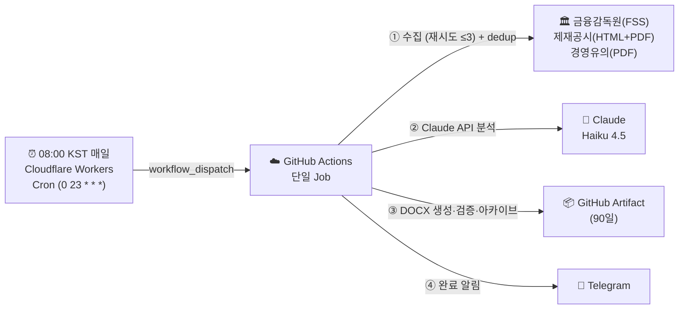

# IBK FSS 제재·경영유의 브리핑 파이프라인

> IBK기업은행 내부통제점검팀 — 금융감독원(FSS) 제재공시·경영유의사항 자동 수집·분석·보고서 생성

---

## 한 줄 요약

매일 08:00 KST에 외부 Cloudflare Workers Cron이 GitHub Actions를 트리거하면, 단일 클라우드 Job이 금융감독원(FSS) 신규 제재공시·경영유의사항을 2소스에서 스크래핑(중복방지 원장 seen_ids와 대조)하고 Claude AI가 IBK 벤치마킹 관점으로 분석해, 자가점검 액션이 담긴 DOCX 보고서와 Telegram 알림을 생성하는 완전 클라우드 파이프라인이다. 산출물은 런별 슬롯(am/pm)으로 분리 보존한다. (로컬 PC 불필요)

> **사후 모니터링:** 타행·인접 금융회사의 실제 제재사례로 IBK 유사 취약점을 자가점검하고, IBK 직접 제재 시 즉시 대응한다. (법령 시행 전 예방 목적의 입법예고 브리핑과 구분)

---

## 아키텍처 요약



**완전 클라우드 — 단일 실행 환경:**

| 환경 | 역할 | 이유 |
|---|---|---|
| Cloudflare Workers Cron | 매일 08:00 KST 트리거 (`workflow_dispatch`, cron `0 23 * * *`) | GitHub schedule cron은 지연·누락이 잦음 |
| GitHub Actions (클라우드) | 수집·분석·보고서·검증·아카이브·알림 (단일 Job) | 24/7 안정적 실행 ※ FSS는 해외 IP 차단 없음이 검증됨(미국 러너 PASS) → 프록시 불필요 |

---

## 에이전트 구성

모든 단계는 GitHub Actions 단일 Job(클라우드)에서 순차 실행된다.

| 순서 | 파일 | 역할 |
|---|---|---|
| ① | `fss_crawler.js` | 제재·경영유의 수집 — FSS 2소스 스크래핑(제재공시 HTML+PDF / 경영유의 PDF) + `state/seen_ids.json` 대조 dedup (최대 3회 재시도, 실패 격리) |
| ② | `analyst.js` | Claude API(Haiku 4.5)로 신규건만 LLM 분석 · Tier·위험도 판정 · 부서 배정 |
| ③ | `briefV2.js` | DOCX 보고서 생성 (맑은 고딕·IBK Blue) + Telegram 메시지(tgMsg) 구성 |
| ④ | `validator.js` | 품질 검증 |
| ⑤ | `archivist.js` | 감사 로그·메타데이터 아카이브 |

보조: `runslot.js`(am/pm 슬롯·경로 결정), `notify_telegram.js`(알림 발송).

---

## 중요도 체계 (Tier × 위험도)

제재 마감(D-day) 개념은 없다. 기관 계층 Tier와 위험도로 선별·정렬한다.

| Tier | 대상 | 알림 | 보고서 |
|---|---|---|---|
| **T0** IBK직접 | 기업은행·IBK·중소기업은행 | ✅ | ✅ |
| **T1** 은행 | 시중·국책·지방·인터넷전문·외은지점 등 | ✅ | ✅ |
| **T2** 인접금융 | 금융지주·저축은행·보험·증권·카드·캐피탈 등 | ✅ | ✅ |
| **T3** 주변 | 대부업·환전영업소·소액송금·GA 등 | ❌ (헤더에 건수만 표기) | ✅ (하위 수록) |

위험도(상/중/하)는 제재수위·IBK 핵심업무 연관·재발 가능성으로 analyst가 판정한다. 상세: `knowledge/fss_tier_methodology.md`.

---

## 핵심 출력물

| 출력물 | 위치 | 보관 |
|---|---|---|
| DOCX 보고서 | `reports/DATE/{slot}/DATE_{morning\|afternoon}_brief.docx` | GitHub Artifact 90일 |
| PDF 원문 | `reports/DATE/{slot}/pdfs/*.pdf` | 감사·인적검증용 |
| 수집+분석 데이터 | `reports/DATE/{slot}/crawl_result.json` | git 추적 |
| 중복방지 원장 | `state/seen_ids.json` | git 커밋 (유일한 상태 저장소) |
| Telegram 알림 | 사용자 채팅(`TELEGRAM_CHAT_ID`) | 즉시 전달 |

---

## 빠른 시작

완전 클라우드 운영이므로 평상시 로컬 작업은 필요 없다. 아래는 최초 1회 설정과 수동 실행 방법이다.

### 1. 요구사항

- GitHub CLI (`gh`) 설치 및 로그인 (수동 실행용)
- Telegram 봇 1개 — **FSS 전용 신규 봇** (FSC 법령 알림 채널과 분리)
- Anthropic API 키
- (트리거용) Cloudflare Workers 계정 — `cloud-trigger/` 참고

### 2. GitHub Secrets 등록 (최초 1회)

| Secret | 값 |
|---|---|
| `ANTHROPIC_API_KEY` | Anthropic API 키 |
| `TELEGRAM_BOT_TOKEN` | FSS 전용 봇 토큰 |
| `TELEGRAM_CHAT_ID` | 사용자 Telegram 채팅 ID |

### 3. 트리거 배포 (최초 1회)

`cloud-trigger/`의 Cloudflare Workers Cron(`0 23 * * *` = 08:00 KST 매일)이 GitHub `workflow_dispatch`를 호출한다. 배포 방법은 `cloud-trigger/README.md`를 참고한다.

### 4. 수동 실행

```powershell
gh workflow run "IBK FSS Sanction Brief" --ref main
```

→ 단일 GitHub Actions Job이 수집부터 알림까지 전부 클라우드에서 실행한다. (발화시각으로 am/pm 슬롯 자동 판별 — 08:00 정시 실행은 am 슬롯)

---

## 디렉토리 구조

```
ibk-FSS-brief/
├── .github/workflows/
│   ├── daily-brief.yml      ← 메인 클라우드 워크플로우 (수집~알림 단일 Job)
│   └── diag-fss-access.yml  ← FSS 해외 IP 접근 진단(1회성 검증, PASS)
├── cloud-trigger/           ← Cloudflare Workers Cron (08:00 KST 트리거)
├── fss_crawler.js           ← ① 수집기 (FSS 2소스 스크래핑 + seen_ids dedup)
├── runslot.js               ← am/pm 슬롯·경로 결정 헬퍼
├── analyst.js               ← ② LLM 분석 (Tier·위험도·부서)
├── briefV2.js               ← ③ DOCX 생성 + tgMsg 구성
├── validator.js             ← ④ 검증
├── archivist.js             ← ⑤ 아카이브
├── notify_telegram.js       ← Telegram 알림 발송
├── state/
│   └── seen_ids.json        ← 중복방지 원장 (유일한 상태 저장소)
├── knowledge/
│   ├── fss_tier_methodology.md    ← 기관 Tier × 위험도 선별 방법론
│   ├── ibk_action_rules.md        ← 부서 배정·자가점검 액션 추론 지침
│   ├── ibk-dept-mapping.md        ← IBK 부서 매핑
│   ├── ibk_org_chart.md           ← IBK 조직도
│   ├── ibk_mapping_rules.md       ← 제재사유-내규 매핑
│   ├── ibk-keywords.md            ← Tier 판정 키워드
│   └── tone-guide.md              ← 라이팅 원칙(해요체)
├── docs/
│   ├── README.md           ← 이 파일
│   ├── ARCHITECTURE.md     ← 전체 시스템 아키텍처
│   ├── AGENT_ORG_CHART.md  ← 에이전트 조직도
│   ├── workflow.md         ← 일별 워크플로우
│   ├── METHODOLOGY.md      ← 설계 철학·글쓰기 원칙
│   ├── LESSONS_LEARNED.md  ← 기술 교훈 체크리스트
│   ├── EXECUTIVE_BRIEF.md  ← 경영진 보고
│   └── SKILL.md            ← DOCX 레이아웃 명세
├── reports/{DATE}/{slot}/         ← slot ∈ {am, pm} · 런별 분리 보존
│   ├── crawl_result.json          ← 수집+분석 데이터
│   ├── DATE_{morning|afternoon}_brief.docx  ← 최종 보고서
│   ├── pdfs/                      ← PDF 원문 (감사용)
│   └── validation_result.json     ← 검증 결과
└── logs/
    └── run_manifest.jsonl         ← 실행 매니페스트(감사 추적)
```

---

## 관련 문서

| 문서 | 내용 |
|---|---|
| [ARCHITECTURE.md](ARCHITECTURE.md) | 전체 시스템 구조, 데이터 흐름, 외부 서비스 |
| [AGENT_ORG_CHART.md](AGENT_ORG_CHART.md) | 에이전트 계층도, 입출력 명세 |
| [workflow.md](workflow.md) | 단계별 일별 실행 절차, 오류 대응 |
| [METHODOLOGY.md](METHODOLOGY.md) | 멀티에이전트 설계 이유, 글쓰기 원칙 |
| [LESSONS_LEARNED.md](LESSONS_LEARNED.md) | 기술 교훈 — 유사 아키텍처 프로젝트 필독 체크리스트 |
| [EXECUTIVE_BRIEF.md](EXECUTIVE_BRIEF.md) | 경영진·C-Level 보고 요약 |
| [SKILL.md](SKILL.md) | DOCX 레이아웃 실측값 (수정 금지) |

---

## Telegram 알림 예시

**IBK 관심(T0·T1·T2) 있는 경우:**
```
🔔 FSS 제재·경영유의 브리핑 (08:04)
소관부처: 금융감독원 | 신규 5건 · IBK 관심 2건 🚨 (T3 1건 제외)
🔴 ○○은행: 자금세탁방지(AML) 내부통제 미비로 기관경고·과태료
📋 자금세탁방지부의 고객확인(KYC)·의심거래보고 절차 자가점검을 제안해요
```

**IBK 관심 대상 없는 경우:**
```
🔔 FSS 제재·경영유의 브리핑 (08:04)
소관부처: 금융감독원 | 신규 3건 (전부 T3)
✅ IBK 벤치마킹 관심 대상 없음 — 기존 점검 체계 유지
```

---

## 향후 계획

| Phase | 내용 | 상태 |
|---|---|---|
| Phase 1~4 | FSS 2소스 수집·dedup · Claude 분석(Tier·위험도) · DOCX 보고서 · Telegram 알림 | ✅ 완료 |
| Phase 5 | MS Teams 알림 채널 추가 | 🔲 검토 중 |
| Phase 6 | 이메일 DOCX 자동 발송 | 🔲 검토 중 |
| Phase 7 | 제재 이력 대시보드(기관·유형별 추이) | 🔲 검토 중 |

---

_담당: IBK기업은행 내부통제점검팀_

_last updated: 2026-07-02 (FSS 현행 구현 기준 갱신)_
