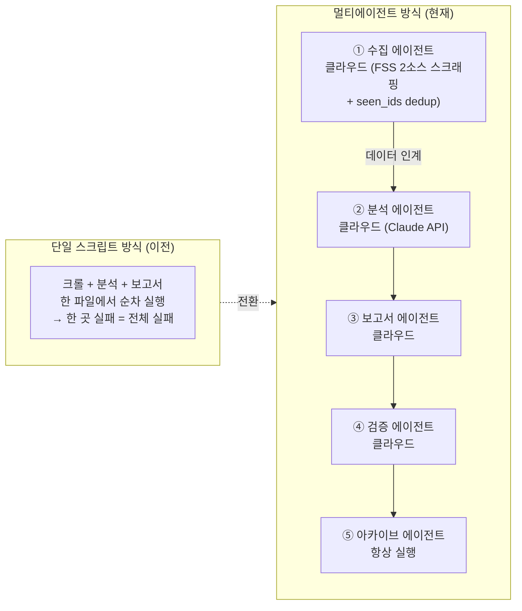

# 방법론

> IBK FSS 제재·경영유의 브리핑 파이프라인 — 설계 철학 및 글쓰기 원칙

---

## 1. 왜 멀티에이전트 아키텍처인가

### 단일 스크립트 방식의 한계

초기에는 수집 → 분석 → 보고서 생성을 하나의 스크립트에서 처리했다. 다음 문제가 반복됐다.

| 문제 | 영향 |
|---|---|
| 한 단계 실패가 전체 중단 | 수집 성공해도 분석 오류 시 보고서 없음 |
| 코드 수정 시 전체 재검증 필요 | 유지보수 비용 급증 |
| LLM 응답 품질 모니터링 불가 | 잘못된 부서명·어미 오류 방치 |
| 로컬 실행만 가능 | PC 꺼져 있으면 파이프라인 중단 |

### 멀티에이전트로 해결한 것



**멀티에이전트 방식의 이점:**

| 항목 | 내용 |
|---|---|
| 장애 격리 | 분석 에이전트가 실패해도 fallback 모드로 계속 진행 |
| 독립 배포 | 각 에이전트를 개별 수정·재실행 가능 |
| 관심사 분리 | 수집·분석·보고서·검증·아카이브가 각자의 책임만 가짐 |
| 중복 방지 | `state/seen_ids.json` ledger로 이미 처리한 제재·경영유의 건을 재알림하지 않음 |
| LLM 품질 관리 | validator.js가 LLM 출력을 별도 검증 |

### 수집 방식: FSS 2소스 스크래핑 + 관측 창 차집합 (완전 클라우드)

금융감독원(FSS)은 제재/경영유의 건을 **부정기적으로** 게시한다. data.go.kr OPEN API에는 해당 제재 서비스가 없어(실측 확인), 공시 페이지를 직접 스크래핑한다.

**FSS 목록엔 게시일 컬럼이 없다.** 3번째 컬럼은 `제재조치요구일`이고 목록은 그 값의 내림차순 정렬이다 → 오늘 새로 게시된 건도 조치요구일이 과거면 목록 맨 위가 아니라 **중간에 삽입**된다. 날짜로는 신규를 판정할 수 없다.

```
수집 소스 (fss_crawler.js) — 통합 collectSource로 두 목록을 각각 순회:
  ① 제재공시   https://www.fss.or.kr/fss/job/openInfo/list.do?menuNo=200476   (SOURCES.sanction)
  ② 경영유의   https://www.fss.or.kr/fss/job/openInfoImpr/list.do?menuNo=200483 (SOURCES.mngimpr)

신규 판정 = 직전 실행 관측 창 차집합 (scan-window diff)

  buildScanWindow(직전 crawl_result.scanAudit)
      → 소스별 { 본 key 집합, 훑은 깊이(depth) }

  classifyRow(key, page, ledgerMap, win, seed) → known | new | backfill | skip
      레저/직전 창에 있음                → known    (재알림 차단)
      seed(최초 실행)                    → backfill (목록 전체가 과거 누적분)
      page ≤ win.depth 이고 레저에 없음  → new      (조치요구일이 과거여도 신규)
      page >  win.depth                  → backfill (창 밖 — 판정 근거 없음)
      직전 창 유실 시 depth = WINDOW_FALLBACK_DEPTH 가정

  backfill → state/seen_ids.json 에만 등록 + crawl_result.backfilled[] 에 명시 기록
             (보고 제외. 단, 침묵 폐기 금지)

  레저 state/seen_ids.json: 소스별 고유키 유지 → 08:00·16:00 두 실행 간 재알림 차단.
  클라우드 실행이라 git repo가 유일한 상태 저장소.

수집 파이프라인 (두 소스 공통, 통합 collectSource)
  scanSource(목록 스냅샷) → classifySnapshot → reconcile(총건수 체크섬) → buildEntry(본문·PDF)
  체크섬: listTotal − prevListTotal == 신규 − 삭제   (불일치 → 전 페이지 심화 스캔 승격)
  커버리지: ledger.meta.sources[소스].covered

관측 창 깊이: --pages 기본 5 (FSS_MAX_PAGES)
  scanWindow.floorLookbackDays < 45일 → 창이 얕다고 경고
  (창이 얕으면 늦게 게시된 과거 조치요구일 건이 창 밖에 떨어져 영구 미탐)

산출:
  성공 → crawl_result.{ newItems[], backfilled[], scanWindow{}, completeness{}, scanAudit[] }
         newItemBasis: "scan-window-diff"
         + state/seen_ids.json 갱신 (+ 있으면 failure_meta 삭제)

폐지: REPORT_SINCE(게시일 앵커) — env 설정 시 무시 + 경고. postDate → actionRequestDate.
```

> **폐지 경위:** 처음에는 게시일 앵커(`REPORT_SINCE`)로 신규를 가렸다. 그런데 목록의 정렬 기준(조치요구일)에 커트오프를 건 탓에 **늦게 게시된 과거 조치요구일 건이 침묵 폐기**됐고, 레저를 통틀어 유일한 IBK 계열 건인 `아이비케이신용정보`(2026-07-09 게시, 조치요구일 06-25)를 놓쳤다. 이 미탐을 발견해 2026-07-10 앵커를 폐지하고 관측 창 차집합으로 전환했다.

> **FSC 프로젝트와의 결정적 차이:** FSC 브리핑은 예방(법령 변경 사전 대응, 의견마감 D-day 존재)이었다.
> FSS는 사후(실제 제재사례 기반 IBK 자가점검·벤치마킹)다. 의견마감·시행일 같은 D-day 개념이 없고,
> 대신 **관측 창 차집합(scan-window diff) + 중복방지 ledger**와 **기관 계층(Tier) × 제재 강도 기반 중요도**가 파이프라인의 축이 된다.
> (정부입법지원센터 OPEN API·KR 경유 프록시·FSC HTML fallback 등 FSC 시절 수집 계층은 이 프로젝트에 없다.)

### 실행 스케줄

- **매일 2회 08:00·16:00 KST** (Cloudflare Workers Cron `0 23 * * *` UTC = am / `0 7 * * *` UTC = pm → 각 실행마다 GitHub Actions 단일 Job). FSC 브리핑과 동일한 오전/오후 커버리지.
- 슬롯 판별은 발화시각 KST로(runslot.js/워크플로우, <12=am, ≥12=pm). 오전(am)은 전체 알림, 오후(pm)는 `--delta-since reports/{date}/am/crawl_result.json` + seen_ids dedup로 오전 이후 신규만 델타 알림하고, 신규 0건이면 '변동 없음 · 기존 점검 유지' 마감 알림. 산출물은 reports/{date}/{slot}/로 슬롯별 분리 보존(공존·비파괴).
- 제재는 부정기 발행이라 오후는 대개 '신규 없음' 조용한 마감이 된다.
- 수집~알림 전부 실행당 GitHub Actions 단일 Job에서 실행 (로컬 PC 불필요).

---

## 2. 글쓰기 프레임워크

### Amazon "Working Backwards" 원칙

아마존이 제품 개발 시 사용하는 "고객 입장에서 역방향 설계" 방식을 글쓰기에 적용했다.

**전통적 제재 보고서 방식 (지양):**
```
1. 제재 대상 기관·법적 근거 나열
2. 위반 사실관계 상세 기술
3. 제재 수위(과태료·기관경고 등) 명시
4. 참고 사항
→ 담당자는 끝까지 읽어야 "IBK가 뭘 점검해야 하는지" 파악 가능
```

**Working Backwards 방식 (채택):**
```
1. 제재대상: [기관] — [무슨 일이 있었나]         ← 사실 먼저
2. IBK에도 발생 가능한가요? — [재발 가능성/영향]
3. 무엇을 점검할까요? — [부서별 제안형 자가점검]
→ 카드 한 장만 읽어도 "우리가 오늘 무엇을 점검할지" 파악 가능
```

### Axios "Smart Brevity" 원칙

뉴스레터 Axios의 기사 작성 원칙을 제재 브리핑 카드에 적용했다.

**카드 3-파트 구조:**

| 파트 | 내용 | 성격 |
|---|---|---|
| 무슨 일이 있었나요? (what_changes) | 제재 사유·위반 사실 핵심 | 사실 요약 |
| IBK에도 발생 가능한가요? (ctrl_insight) | IBK 유사 업무의 재발 가능성·영향 | 벤치마킹 관점 |
| 무엇을 점검할까요? (our_action) | 부서별 제안형 자가점검 항목 | 액션 |

> 제재는 법적으로 민감하다. 분석은 단정("위반이다")을 피하고 **"IBK에도 발생 가능한가요? → 이런 부분을 점검하시면 좋아요"** 형태의 **점검 제안형**으로만 서술한다(tone-guide 준수).

**중요도별 노출 차등:**

| 등급 | 표시 | 서술 밀도 |
|---|---|---|
| 🔴 상 | 카드 헤더 기관명 빨강 강조 | 풀 3파트 |
| 🔶 중 | 카드 | 3파트 |
| 🔹 하 | 카드 | 핵심 위주 |

> 등급은 의견마감 D-day가 아니라 **기관 계층(Tier) × 제재 강도**로 산정한다(§4·`knowledge/fss_tier_methodology.md`).

---

## 3. 토스뱅크 스타일 한국어 어조 가이드

### 기준 예시 (해요체 · 제안형)

> "여신 담당자라면 이번 A은행 여신심사 관련 제재 사례를 한번 살펴보세요.  
> 담보 평가 근거를 문서로 남기지 않아 지적됐어요. IBK도 유사 업무가 있는지 점검해 보시면 좋아요."

이 예시가 모든 원칙의 기준이다. 어색하면 이 예시와 비교한다. analyst.js는 `knowledge/tone-guide.md`를 시스템 프롬프트에 주입해 **해요체**를 강제한다.

---

### 8개 원칙 요약

| # | 원칙 | 핵심 |
|---|---|---|
| 1 | 핵심을 먼저 쓴다 | 사실 → 재발 가능성 → 점검 순서 |
| 2 | 짧은 문장을 쓴다 | 한 문장 = 한 사실 |
| 3 | 쉬운 단어를 선택한다 | 제재 결정문 원문 그대로 옮기지 않음 |
| 4 | 독자를 주어로, 제안형으로 | "[부서명] 담당자라면 ~살펴보세요" |
| 5 | 불필요한 단어를 뺀다 | "이에 따라", "상기와 같이" 등 제거 |
| 6 | 숫자와 날짜는 구체적으로 | 제재조치일·제재조치요구일을 구체 표기 (FSS 목록엔 게시일이 없다 — 목록 등장 시점은 '최초 등장일'로 표기) |
| 7 | 해요체로 끝낸다 | "~점검해 보세요", "~있었어요" (명사형·개조식 종결 금지) |
| 8 | 친근하되 단정은 피한다 | "~할 수 있어요" 추측형·단정 금지 |

---

### 강요형 vs 제안형 어미 대조

| ❌ 강요형/단정 (금지) | ✅ 제안형 (사용) |
|---|---|
| ~해야 합니다 | ~한번 살펴보세요 |
| ~하여야 합니다 | ~해 보세요 |
| 검토가 필요합니다 | 한번 살펴보세요 |
| 위반입니다 / 제재 사유입니다 | ~때문에 지적됐어요 |
| 준수 의무가 있습니다 | ~에 주의가 필요해요 |
| 모니터링할 예정입니다 | (삭제) |

### 제재 용어 → 브리핑 용어 변환표

| 제재/결정문 원문 | 브리핑 표현 |
|---|---|
| 과태료 부과 처분 | 과태료를 물게 됐어요 |
| 기관경고 조치 | 기관경고를 받았어요 |
| 경영유의사항 통보 | 경영에 유의하라고 안내받았어요 |
| 내부통제기준 미비 | 내규에 빠진 항목 |
| 임직원 제재(감봉·견책 등) | 담당 직원도 함께 조치됐어요 |
| 시정·개선 요구 | 고치라고 요청받았어요 |
| 금융소비자보호 위반 | 소비자 보호에서 지적됐어요 |
| 건전성 규제 위반 | 리스크 관리 규정에서 지적됐어요 |

---

## 4. 하네스 엔지니어링 (Harness Engineering)

파이프라인의 신뢰성을 위해 각 에이전트마다 종료 코드 체계와 fallback 메커니즘을 설계했다.

### 종료 코드 체계

| 에이전트 | exitCode 0 | exitCode 1 | exitCode 2 |
|---|---|---|---|
| fss_crawler.js | 정상 | — | 수집 실패(2소스 모두) → 파이프라인 중단 |
| analyst.js | 정상 | fallback 모드 (계속) | 치명 오류 → 중단 |
| briefV2.js | 정상 | DOCX 생성 실패 → 중단 | — |
| validator.js | 통과 | 경고 (계속) | 오류 → status=warn |
| archivist.js | 정상 | — | — (항상 성공으로 처리) |

### Fallback 계층 구조

```
fss_crawler.js 수집:
  통합 collectSource(SOURCES.sanction / SOURCES.mngimpr)로 두 목록을 각각 순회.
  scanSource(목록 스냅샷) → classifySnapshot → reconcile(총건수 체크섬) → buildEntry(본문·PDF).
  신규 판정은 직전 실행 관측 창 차집합(scan-window diff) — 직전 crawl_result.scanAudit을
  복원해 그 깊이 안에서 새로 나타난 행만 new. 레저(state/seen_ids.json)는 재알림 차단.
  창 밖 깊이·최초 시드는 backfill → 레저 등록만, 보고 제외(backfilled[]에 명시 기록).
  체크섬 불일치 시 전 페이지 심화 스캔으로 승격.
  → crawl_result.json.
  실패 격리: 수집 실패 시 failure_meta 기록(성공본 비파괴).

analyst.js 실패 처리:
  모델 claude-haiku-4-5-20251001 (ANALYST_MODEL로 오버라이드 가능)
  MAX_TOKENS=2048 (한국어 다필드 분석이 1024 초과 시 JSON 미완결→폴백 방지)
  소규모 병렬 CONCURRENCY=3 (Haiku RPM 여유 내 직렬 병목 회피)
  1차: Claude API 추론 (ANTHROPIC_API_KEY 있을 때, tone-guide 해요체 주입)
  2차: 키워드 기반 템플릿 생성 (API 오류 또는 키 없을 때)
  → exitCode=1로 파이프라인 계속 진행 (보고서는 생성됨). 폴백 항목은 보고서에
    "(키워드 추정 — 검토 필요)" 배지로 노출한다.
```

### 검증 체계 (validator.js)

검증 항목을 4개 그룹으로 나눠 자동 검증한다(경고=계속, 오류=중단 권고).

```
A. 텍스트 품질 (토스 8원칙)  A1~A8
     A1 핵심 선행 / A2 문장 길이(FSS 완화) / A3 금지표현 / A4 독자 주어(상·중) /
     A5 빈말(A3에서 처리) / A6 (FSS 미적용 — D-day 개념 없음) /
     A7 동사 종결 / A7b 해요체("요") 종결 / A8 즉시검토 평어 혼용
B. 절삭 검사                B1~B4  (what_changes / our_action / summary·bodyText / ctrl_insight)
C. 텔레그램 메시지          C0~C4  (출처·글자수·줄수는 info, 시나리오별 필수 패턴)
D. 보고서 구조 (docx 실측)  D0~D7  (헤더·오프닝·항목 카드 라벨·마무리 등을 데이터 기대치와 대조)
```

**LLM 출력 품질 관리:**  
Claude API가 생성한 필드(what_changes, ctrl_insight, our_action, dept)를 사람이 직접 검수하지 않고 코드로 자동 검증한다. 부서명 오류, 글자 수 초과, 해요체 위반을 자동 감지해 다음 실행의 프롬프트 개선에 활용한다.

---

## 5. 지식 베이스 분리 원칙

LLM 프롬프트와 비즈니스 지식을 코드에서 분리해 관리한다.

```
코드 (analyst.js)      → "어떻게 분석할 것인가" (불변)
지식 베이스 (knowledge/) → "무엇을 참고할 것인가" (자주 업데이트)
```

| 파일 | 내용 | 업데이트 주기 |
|---|---|---|
| `agents/analyst_system_prompt.md` | LLM 분석·글쓰기 시스템 프롬프트 | 드물게 (원칙 변경 시) |
| `knowledge/fss_tier_methodology.md` | 기관 계층(T0~T3) × 제재강도 중요도 방법론 | 방법론 조정 시 |
| `knowledge/ibk-dept-mapping.md` | IBK 공식 부서 매핑 | 조직 개편 시 |
| `knowledge/org/versions/*.json` | 반기별 IBK 조직 정본·안정 ID·시행일 | 1월·7월 조직개편 시 |
| `knowledge/generated/ibk_current_org_registry.md` | LLM·사람용 현행 조직표(자동 생성) | 직접 수정 금지 |
| `knowledge/ibk_mapping_rules.md` | 제재 유형-내규 매핑 테이블 | 규정 개정 시 |
| `knowledge/ibk_action_rules.md` | 부서별 점검 액션 규칙 | 필요 시 |
| `knowledge/ibk-keywords.md` | Tier 키워드 사전 | 필요 시 추가 |
| `knowledge/tone-guide.md` | 라이팅 8원칙(해요체) 상세 | 드물게 |

**운영 원칙:** 지식 베이스 파일만 수정하면 analyst.js 재배포 없이 LLM 동작이 바뀐다. 코드 수정 없이 업무 로직을 관리할 수 있다.

---

## 6. 감사 대응 설계

IBK기업은행 내부통제점검팀의 특성상 감사 추적이 가능해야 한다. 제재는 법적으로 민감하므로 원문 근거 보존이 특히 중요하다.

| 감사 요구사항 | 설계 결정 |
|---|---|
| 분석 근거 보존 | crawl_result.json에 원문 URL + 제재 본문 요약 포함 |
| 원문(PDF 등) 보관 | fss_crawler.js가 첨부(제재/경영유의 결정문)를 reports/DATE/{slot}/ 하위에 보존 |
| 중복·처리 이력 | `state/seen_ids.json` ledger(openInfo/openInfoImpr)가 이미 처리한 건을 기록 — repo가 유일한 상태 저장소 |
| 런별 산출물 분리 | reports/DATE/{am\|pm}/ 슬롯 폴더로 **런별 분리 보존(덮어쓰기 금지)** |
| 실행 이력 추적 | run_manifest.jsonl에 모든 실행 기록 누적 |
| 보고서 버전 관리 | GitHub Artifacts에 90일 보관 |
| 파이프라인 로그 | archivist.js가 logs/DATE/pipeline.log 이동·보존 |
| 보관 정책 | DOCX 90일 · JSON 30일 · 로그 14일 자동 정리 |

---

_last updated: 2026-07-12 (신규 판정을 게시일 앵커 → 직전 실행 관측 창 차집합(scan-window diff)으로 전환, REPORT_SINCE 폐지 반영)_
