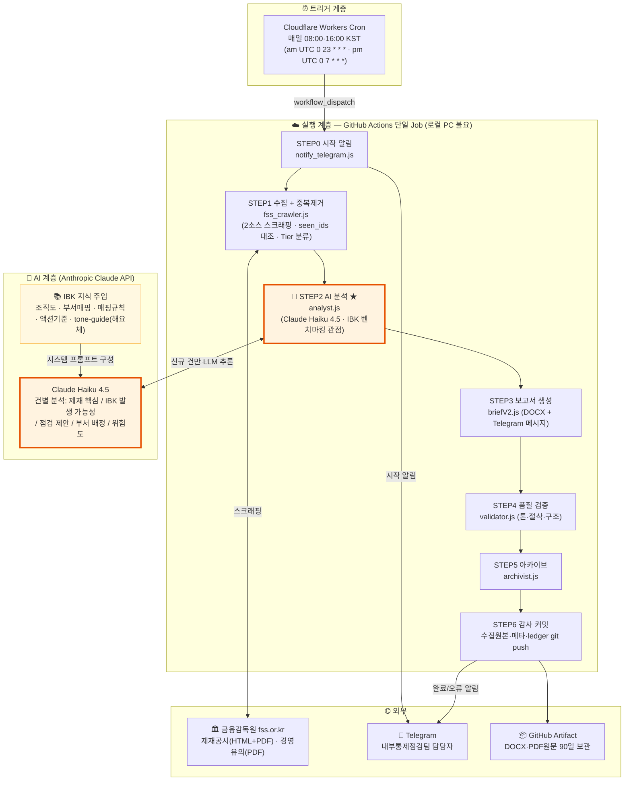
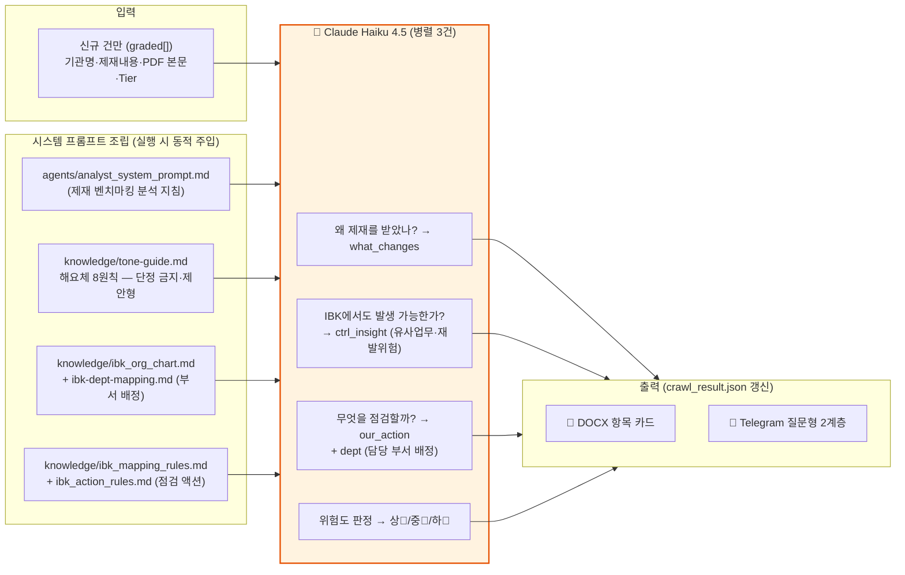

# 업무문서 — FSS 제재·경영유의 브리핑 운영 업무 정의서

> **프로젝트**: IBK FSS 제재·경영유의 브리핑 (ibk-FSS-brief)
> **주관**: IBK기업은행 내부통제점검팀
> **작성일**: 2026-07-02 · **개정일**: 2026-07-12 (신규 판정 전환 반영) · **상태**: 라이브 운영 중
> **관련 문서**: [SOD](01_SOD.md) · [BRD](02_BRD.md) · [기술문서](04_TECH_DOC.md) · [예상질의답변](05_QNA.md)

---

## 1. 업무 정의

**타 금융회사의 실제 제재사례를 IBK 자가점검 트리거로 전환하는 업무**다. 금융감독원이 게시하는 제재공시·경영유의사항 중 신규 건을 매일 자동 수집하고, AI(Claude LLM)가 "IBK에도 같은 통제 미비점이 있는가"라는 벤치마킹 관점으로 분석해, 담당자에게 Telegram 알림과 DOCX 보고서로 전달한다.

| 구분 | 내용 |
|---|---|
| 업무 성격 | **사후(事後) 모니터링** — 실제 제재사례 기반 자가점검 (법령 변경 대응 FSC 브리핑의 '예방' 성격과 구분) |
| 수행 주기 | 매일 08:00·16:00 KST 2회 자동 실행 (am·pm, 주말 포함, 신규 0건 시 조용한 알림) |
| 수행 주체 | 시스템(완전 자동) + 담당자(수신 후 점검 실행) |
| 대상 원천 | FSS 제재공시(openInfo) · 경영유의·개선사항(openInfoImpr) |

---

## 2. AI 적용 아키텍처 시각화

### 2.1 전체 아키텍처 — AI 적용 지점 표시



★ AI가 개입하는 단계는 **STEP2(분석) 하나뿐**이다. 수집·판별·보고서 조립·검증·보존은 전부 결정적(deterministic) 코드로 동작해, AI 오류가 데이터 수집·감사 기록을 오염시킬 수 없는 구조다.

### 2.2 AI 분석 단계 내부 구조 (STEP2 상세)



### 2.3 AI 적용 지점 요약표

| 적용 지점 | AI 역할 | 사람/코드의 통제 장치 |
|---|---|---|
| 제재 핵심 요약 (what_changes) | 원문(HTML·PDF)에서 제재 사유·수위를 평이하게 요약 | validator A1(핵심 선행)·B(절삭 검사) |
| IBK 발생 가능성 (ctrl_insight) | IBK 유사업무 존재 여부·재발 위험을 추론 | 단정 금지 톤 강제 (tone-guide 주입) |
| 점검 제안 (our_action) | "~점검을 제안해요" 형태의 실행 가능한 자가점검 액션 생성 | validator A7(동사 종결)·A7b(해요체) |
| 부서 배정 (dept) | IBK 조직도·매핑규칙 기반 담당 부서 지정 | knowledge/ 정본 문서로만 판단 |
| 위험도 (risk_grade) | 제재수위·핵심업무 연관·재발 가능성으로 상/중/하 | Tier(코드 판정)와 교차 적용 |
| **AI 미적용** | 수집·신규판별(dedup)·Tier분류·보고서조립·검증·커밋 | 전부 결정적 코드 (fss_crawler·briefV2·validator 등) |
| **장애 대비** | API 키 오류 시 키워드 템플릿 fallback으로 강등 | 파이프라인은 계속, 완료 알림에 반영 |

---

## 3. 일일 운영 흐름 (담당자 관점)

### 3.1 평상시 (개입 불요)

| 시각 | 이벤트 | 담당자 행동 |
|---|---|---|
| 08:00 (am) | `⚙️ 브리핑 생성 시작합니다` 알림 | 없음 |
| 08:0x | 완료 알림 수신 — 신규 건별 질문형 카드 또는 "신규 없음" | 알림 확인 |
| 16:00 (pm) | pm 시작 알림 | 없음 |
| 16:0x | 완료 알림 수신 — 오전 이후 신규만(델타), 없으면 "변동 없음 · 기존 점검 유지" | 알림 확인 |
| 이후 | 필요 시 DOCX 보고서 다운로드 (GitHub Actions → Artifact `fss-brief-{날짜}-{am\|pm}`) | T0·T1 건 우선 검토, 점검 제안을 유관 부서 공유 |

### 3.2 알림 읽는 법 (질문형 2계층)

```
🔔 금융감독원 제재·경영유의 브리핑 (08:04)
소관부처: 금융감독원 | 신규 5건 · IBK 관심 2건 🚨 (T3 1건 제외)

제재대상: ○○은행 [은행]  (일자·유형)
· 왜 제재를 받았나요?
    → (제재 핵심 — what_changes)
· IBK에서도 발생 가능한가요?
    → (유사업무·재발위험·담당부서 — ctrl_insight)
· 이런 부분을 점검하시면 좋아요
    → (자가점검 제안 — our_action)
```

- **🔴 상 / 🔶 중 / 🔹 하** = AI가 판정한 위험도. 🔴은 당일 검토 권장.
- `[은행]` `[인접금융]` 등 = 기관 계층 태그. **T3(주변)는 알림에서 제외**되고 헤더에 건수만 표기된다 (보고서에는 전건 수록).
- `✅ 신규 제재·경영유의 없음 — 기존 점검 유지` = 정상 실행됐고 신규가 없었다는 뜻 (미실행과 다름 — 미실행이면 시작 알림 자체가 없다).

### 3.3 기관 계층(Tier)의 업무적 의미

| Tier | 대상 | 업무 처리 |
|---|---|---|
| **T0** IBK직접 | 기업은행·중소기업은행·IBK | **즉시 대응** — 해당 제재 건 직접 확인·보고 |
| **T1** 은행 | 시중·국책·지방·인터넷전문 등 | **직접 벤치마킹** — 동일 업권, 당일 점검 제안 검토 |
| **T2** 인접금융 | 금융지주·저축은행·보험·증권·카드 등 | **관심** — 유사 업무 존재 시 점검 검토 |
| **T3** 주변 | 환전영업소·대부·GA·P2P 등 | **참고** — 보고서에서만 확인 |

### 3.4 DOCX 보고서 구조

제목 "⚖️ 오늘의 제재·경영유의 브리핑" 아래 전건이 동일한 항목 카드로 수록된다 (Tier→위험도 정렬):

`제재대상(기관·계층·일자)` → `무슨 일이 있었나요?` → `IBK에도 발생 가능한가요?` → `무엇을 점검할까요?`

첨부 PDF 원문은 Artifact의 `pdfs/` 폴더에 감사 증빙으로 함께 보관된다.

---

## 4. 예외 상황 대응 절차

| 상황 | 알림 | 담당자 조치 |
|---|---|---|
| 수집 실패 (3회 재시도 후) | `❌ 수집 실패 — 데이터 미확인, 재실행 필요` | FSS 사이트 접속 확인 후 수동 재실행: `gh workflow run "IBK FSS Sanction Brief" --ref main` (오후 재실행은 pm 슬롯으로 분리 저장되어 오전 기록을 덮지 않음) |
| 파이프라인 오류 | `❌ 브리핑 오류 발생 — GitHub Actions 로그 확인 필요` | Actions 실행 로그에서 실패 STEP 확인 |
| AI 분석 강등 (fallback) | 완료 알림은 오나 분석 문면이 템플릿형 | `ANTHROPIC_API_KEY` Secret 유효성 확인 |
| 시작 알림 자체가 없음 | — | Cloudflare Worker 상태·GH_PAT 만료 확인 (cloud-trigger/README.md) |
| 주말 알림 | "신규 없음" 조용한 알림 | 무시 (결정 B — am·pm cron 모두 매일 실행) |

**중요**: 수집 실패 시 시스템은 "신규 없음"으로 오인 보고하지 않는다. 실패 기록(failure_meta.json)은 성공 기록과 분리 저장되므로, 기존 데이터·중복방지 원장은 훼손되지 않는다.

---

## 5. 산출물 및 보존 정책

| 산출물 | 위치 | 보존 | 용도 |
|---|---|---|---|
| Telegram 알림 | 담당자 채팅 | 즉시 | 일일 인지 |
| DOCX 보고서 | Artifact `fss-brief-{DATE}-{SLOT}` | 90일 | 부서 공유·점검 실행 |
| PDF 원문 | 동 Artifact `pdfs/` | 90일 | 감사 증빙·인적 검증 |
| 수집+분석 데이터 | `reports/{DATE}/{SLOT}/crawl_result.json` (git) | 영구 | 이력 조회 |
| 중복방지 원장 | `state/seen_ids.json` (git) | 영구 | 신규 판별 상태 (관측 창 차집합(scanAudit)과 병행) |
| 실행 매니페스트 | `logs/run_manifest.jsonl` (git) | 영구 | 감사 추적 |

---

## 6. 컴플라이언스 유의사항

1. **AI 분석은 참고자료다.** 제재사례에 대한 법적 판단·대외 의견 표명의 근거로 직접 사용하지 않는다. 시스템 스스로도 단정 표현을 금지하고 "점검 제안"형으로만 출력하도록 설계돼 있다(tone-guide 주입 + validator 이중 검증).
2. **원문 확인 원칙.** T0(IBK 직접)·🔴(위험도 상) 건은 반드시 Artifact의 PDF 원문 또는 FSS 홈페이지 원문을 확인한 후 조치한다.
3. **감사 추적.** 모든 실행은 git 커밋(`brief: {날짜}/{슬롯} 클라우드 자동 실행`)으로 남으므로 임의 수정하지 않는다.
4. **채널 분리.** 본 알림 봇은 FSS 전용이다. FSC 법령 알림(자매 프로젝트)과 혼용하지 않는다.
