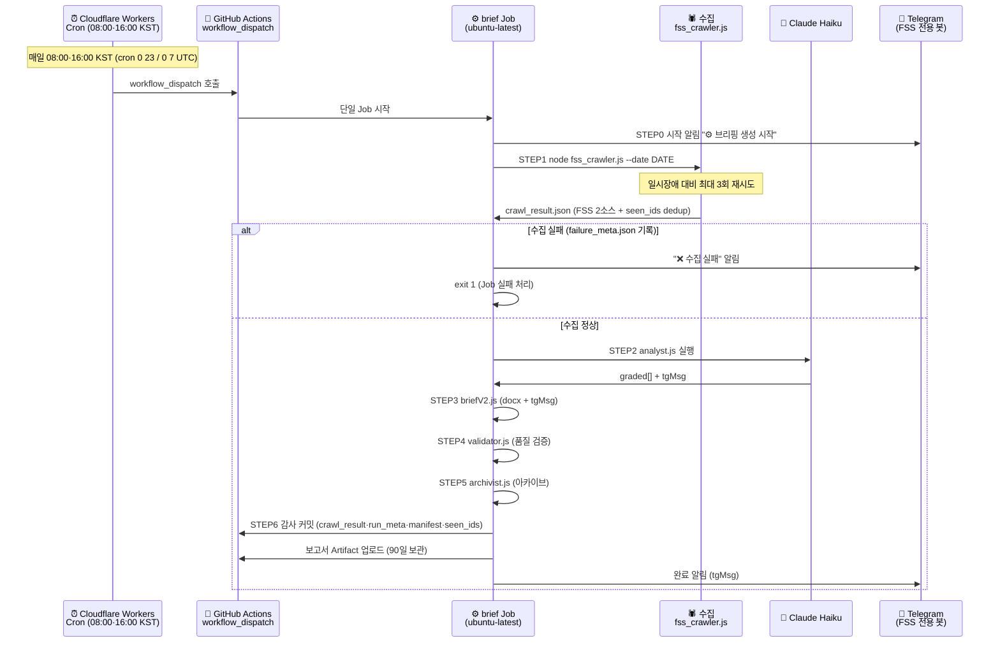

# 워크플로우 (정본)

> IBK FSS 제재·경영유의 브리핑 파이프라인 — 개념 · 단계별 실행 절차 · 오류 대응 (완전 클라우드)
> **이 문서가 워크플로우의 단일 정본이다.** (루트 `workflow.md`는 이 문서를 가리키는 포인터)

표시 규칙:
🤖 = 완전 자동
🖐 = 수동 개입 필요
⚠️ = 이슈 발생 시 수동 확인

> **아키텍처 요약:** 매일 **08:00·16:00 KST**(FSC Morning brief 동형 하루 2회) 외부 **Cloudflare Workers Cron**(`cloud-trigger/`, cron `0 23 * * *`·`0 7 * * *` = 23:00·07:00 UTC)이 GitHub `workflow_dispatch`(워크플로우명 `IBK FSS Sanction Brief`)를 호출하면, 수집부터 알림까지 전부 **GitHub Actions 단일 Job(실행당 1 Job)**에서 실행된다(로컬 PC 불필요). **08:00은 am(전체 알림), 16:00은 pm(오전 이후 신규만 델타 알림)**. 수집은 **금융감독원(FSS) 2소스 직접 스크래핑**(제재공시 openInfo HTML+PDF / 경영유의 openInfoImpr PDF) + `state/seen_ids.json` dedup. 산출물은 런별 슬롯(am/pm)으로 분리 보존한다(`runslot.js`).
> ✅ FSS는 해외 IP 차단이 없어(미국 러너 접근 PASS, `diag-fss-access.yml`) **KR 프록시·OPEN API·FSC fallback 없이 직결 스크래핑**한다. 콜드스타트·일시장애는 재시도로 흡수한다.
> GitHub 자체 schedule cron은 ~11h 지연·누락이 확인돼 제거했다 — 정시성은 Cloudflare가 책임진다.

---

## 일별 실행 흐름 (정상 경로)



### 전체 파이프라인 (STEP별 산출물)

```
[Trigger] 매일 08:00·16:00 KST  Cloudflare Workers Cron → GitHub workflow_dispatch
    │  (수동: gh workflow run "IBK FSS Sanction Brief" --ref main)
    ▼
[GitHub Actions 단일 Job(실행당 1) — .github/workflows/daily-brief.yml]
    ├─ 시작 알림  notify_telegram.js  ─── "⚙️ {DATE} 브리핑 생성 시작합니다."
    ├─ STEP1  fss_crawler.js  ── FSS 2소스 수집 + seen_ids dedup (최대 3회 재시도, 120초 간격)
    │            → reports/{DATE}/{SLOT}/crawl_result.json (신규건만 graded[])
    │            실패 시 failure_meta.json만 기록(성공본 비파괴) → 3회 실패 시 오류 알림·중단
    ├─ STEP2  analyst.js  ───── Claude Haiku LLM 분석 (graded[]만, 병렬 CONCURRENCY=3)
    │            Tier기반 IBK 벤치마킹 · tone-guide 주입 · 부서 배정 · tgMsg 생성
    │            → crawl_result.json 갱신 · exit 0=정상 / 1=fallback(계속) / 2=치명(중단)
    ├─ STEP3  briefV2.js  ───── Word 보고서(docx) + tgMsg 기록
    │            → reports/{DATE}/{SLOT}/{DATE}_{morning|afternoon}_brief.docx
    ├─ STEP4  validator.js  ─── 품질 검증 (톤·절삭·tgMsg·보고서 구조)
    │            → validation_result.json · exit 0=통과 / 1=경고 / 2=오류→status=warn
    ├─ STEP5  archivist.js  ─── 감사 메타 + 로그 정리 (항상 실행)
    │            → run_meta.json · logs/run_manifest.jsonl(누적)
    ├─ STEP6  감사 커밋·push  ── crawl_result · run_meta · run_manifest · state/seen_ids.json
    └─ Artifact 업로드(fss-brief-{DATE}-{SLOT}, 90일) + 완료 알림
                 am: node notify_telegram.js --from-crawl-result
                 pm: … --from-crawl-result --delta-since reports/{DATE}/am/crawl_result.json (오전 이후 신규만)

[오류 알림] 워크플로우 if: failure() → "❌ 브리핑 오류 발생 ({DATE}/{SLOT})"
```

> **런 슬롯(runslot.js):** 산출물은 `reports/{DATE}/{SLOT}/`에 런별 분리 보존(덮어쓰기 금지 = 감사 추적). SLOT은 발화시각 KST로 판별(<12=am, ≥12=pm). **08:00 발화=am, 16:00 발화=pm**. 두 슬롯은 공존·비파괴(서로 덮지 않음). 수동 재실행도 시각으로 슬롯이 자동 분리된다.

---

## Telegram 알림 포맷 (출처: crawl_result.json의 tgMsg)

briefV2.js `buildTgMsg` 생성. **질문형 라벨 + 질문·답변 2계층 레이아웃**(총평단 리뷰 반영). 알림 포함 대상은 Tier T0·T1·T2 전건(T3 주변은 제외, 헤더에 건수만 표기) — [knowledge/fss_tier_methodology.md](../../knowledge/fss_tier_methodology.md).

**신규 IBK 유관 건이 있을 때:**
```
🔔 금융감독원 제재·경영유의 브리핑 (HH:MM)
금감원 신규 중 IBK 유관 N건 (🔴 즉시점검 M) · 주변 K건 참고

🔶 제재대상: {기관} [{계층}] · {일자} · {제재유형}

• 왜 제재를 받았나요?
   {제재 사유}

• IBK에서도 발생 가능한가요?
   {IBK 부서·재발 가능성}

• 이런 부분을 점검하시면 좋아요
   {점검 제안}
```

**신규 IBK 유관 없을 때:** `🔔 금융감독원 제재·경영유의 브리핑` + `금감원 신규 확인 · IBK 유관 없음` + `✅ …`

**오후(pm) 델타:** 16:00 실행은 오전본(`reports/{DATE}/am/crawl_result.json`) 대비 **오전 이후 신규만** 알린다(`--delta-since`, seen_ids dedup). 신규가 있으면 `🔔 [오후 추가 N건 감지]` + 전체 tgMsg, 신규 0건이면 `🔔 금융감독원 제재·경영유의 브리핑 (HH:MM) · N건 확인 · 오전 이후 신규 없음 · ✅ 기존 점검 유지` 마감 알림(시작→완료 짝 보장). 오전본이 없으면(오전 실패/미존재) 게이트 미적용 → 평소대로 전체 전송(놓침 방지).

> 보고서(DOCX) 레이아웃·폰트 위계의 정본은 [../technical/SKILL.md](../technical/SKILL.md)이다(수치 임의 변경 금지).

---

## 단계별 상세 절차

### Phase 1 — 사전 준비 (최초 1회만)

| 단계 | 작업 | 자동화 |
|---|---|---|
| 1-1 | GitHub Secrets 등록 (3개: `ANTHROPIC_API_KEY` · `TELEGRAM_BOT_TOKEN` · `TELEGRAM_CHAT_ID`) | 🖐 |
| 1-2 | Cloudflare Workers Cron 배포 (`cloud-trigger/`) — 08:00·16:00 KST(cron `0 23 * * *`·`0 7 * * *`) `workflow_dispatch` 트리거 + secret `GH_PAT`. ※ 대시보드에서 **두 cron 직접 추가**(wrangler 스케줄 쓰기 차단) | 🖐 |
| 1-3 | Telegram 봇(FSS 전용 신규 봇, FSC 법령 알림과 채널 분리) 생성 + `TELEGRAM_CHAT_ID` 확보 | 🖐 |

> 로컬 클론(`npm install`, `.env`, Task Scheduler 등)은 더 이상 운영에 필요하지 않다. 개별 단계를 수동 디버깅할 때만 선택적으로 사용한다.

---

### Phase 2 — 매일 자동 실행 (정상 경로)

#### Step 1 🤖 트리거 (08:00·16:00 KST)

```
Cloudflare Workers Cron (08:00 KST = 23:00 UTC / 16:00 KST = 07:00 UTC, cron 0 23 * * * · 0 7 * * * 발화)
  → GitHub workflow_dispatch 호출 (IBK FSS Sanction Brief)
  → brief Job (ubuntu-latest) 시작 (발화시각 KST로 슬롯 판별: <12=am, ≥12=pm)
```

> **왜 Cloudflare인가:** GitHub 자체 schedule cron은 ~11h 지연·누락이 확인되어 제거했다. 정시성은 외부 Cloudflare Workers Cron이 책임진다. Worker 코드는 `cloud-trigger/` 폴더에 있다.

#### Step 2 🤖 단일 클라우드 Job (발화 후 ~4분)

```
brief Job (.github/workflows/daily-brief.yml, ubuntu-latest):
  STEP0  시작 알림 (Telegram)           — node notify_telegram.js --msg "⚙️ … 시작"
  STEP1  수집 (FSS 2소스 직접 스크래핑)  — node fss_crawler.js --date DATE  (최대 3회 재시도, 120초 간격)
  STEP2  분석 (Claude Haiku)             — node analyst.js --date DATE      (exit 0=정상/1=fallback/2=치명)
  STEP3  보고서 (docx + tgMsg)           — node briefV2.js --date DATE
  STEP4  검증                            — node validator.js --date DATE    (exit 0=통과/1=경고/2=오류)
  STEP5  아카이브                        — node archivist.js --date DATE --status ok|error
  STEP6  감사 커밋 + push                 — crawl_result.json · run_meta.json · run_manifest.jsonl · state/seen_ids.json
  Artifact 업로드 (fss-brief-DATE-slot, 90일 보관)
  완료 알림 (Telegram, tgMsg)            — node notify_telegram.js --from-crawl-result
```

> **수집 방식:** FSS 2소스 직접 스크래핑 — ① 제재공시 `openInfo`(목록 HTML → 상세, 본문 PDF) ② 경영유의·개선 `openInfoImpr`(목록 → 첨부 PDF). 전체 목록 수집 후 **게시일(postDate) ≥ 앵커 `REPORT_SINCE`(기본 2026-07-02) AND `state/seen_ids.json`에 없던 건**만 신규로 채택. 앵커 이전 게시분(백로그)은 레저에만 등록하고 보고 제외(과거 누적 공시의 '당일 신규' 오인 차단). 게시일 파싱 실패는 fail-open.
> ✅ FSS는 해외 IP 차단이 없어(diag-fss-access.yml PASS) KR 프록시·OPEN API·FSC fallback 없이 러너에서 **직결** 스크래핑한다. 재시도는 egress 우회가 아니라 콜드스타트·일시장애 흡수용이다.

#### Step 3 🤖 수집 실패 처리 (예외 경로)

```
fss_crawler.js를 최대 3회(120초 간격) 재시도해도 성공하지 못하면:
  → failure_meta.json만 기록(성공본 crawl_result.json은 비파괴 보존)
  → node notify_telegram.js --msg "❌ … 수집 실패 …"   (명시적 실패 알림)
  → Job 실패 처리(if: failure() 오류 알림)
```

> **왜 중요한가:** 수집 실패를 "IBK 영향 없음"으로 오인 보고하지 않기 위함이다. 데이터 미확인 ≠ 안전. 실패 시 성공본을 덮지 않고 `failure_meta.json`으로 격리한 뒤, 반드시 실패로 처리하고 재실행을 유도한다.

---

### Phase 3 — 결과 확인 (팀원)

| 확인 항목 | 방법 | 자동화 |
|---|---|---|
| Telegram 완료 알림 수신 | 스마트폰 알림 (FSS 전용 봇) | 🤖 |
| DOCX 보고서 열람 | Actions 탭 → Artifacts → `fss-brief-DATE-slot` | 🖐 |
| 수집 원본 확인 | Artifact 내 `reports/DATE/slot/` (감사·검증 시) | 🖐 |
| 검증 결과 확인 | Artifact 내 `validation_result.json` | ⚠️ 경고 시만 |
| 원시 수집 데이터 | git 커밋된 `reports/DATE/slot/crawl_result.json` | 🖐 (감사 시) |

---

## 수동 실행

### GitHub Actions 수동 실행 (권장)

```powershell
gh workflow run "IBK FSS Sanction Brief" --ref main
```

또는 GitHub → Actions → IBK FSS Sanction Brief → Run workflow.

### 개별 단계 수동 실행 (로컬 디버깅 시)

```powershell
cd D:\projects\ibk-FSS-brief

node fss_crawler.js --date 20260625              # 수집만 (FSS 2소스 직접 스크래핑 + seen_ids dedup)
node analyst.js --date 20260625                  # 분석만 (ANTHROPIC_API_KEY 필요)
node briefV2.js --date 20260625                  # 보고서만
node validator.js --date 20260625                # 검증만
node archivist.js --date 20260625 --status ok    # 아카이브만
```

---

## 오류 대응 절차

### 케이스 1: "❌ 수집 실패" 알림 (FSS 직결 스크래핑 실패)

```
1. GitHub → Actions → 실패한 실행 → STEP 1 로그 + failure_meta.json 확인 (3회 시도 모두 실패한 사유)
2. FSS는 해외 IP 차단이 없어 러너에서 직결한다(프록시 없음). 실패 사유를 계층으로 좁힌다:
   - FSS 사이트 개편/구조 변경으로 목록·상세 파싱 실패(selector·menuNo) → fss_crawler.js 파서 점검
   - 첨부 PDF 다운로드/파싱(pdf-parse) 실패 → 해당 소스만 재시도
   - 일시 네트워크 오류(콜드스타트·5xx) → 대개 재실행으로 해소
3. 실패해도 성공본(crawl_result.json)은 비파괴 보존되고 failure_meta.json만 기록된다(오인 보고 차단).
4. gh workflow run "IBK FSS Sanction Brief" --ref main 으로 재실행
```

### 케이스 2: "❌ 브리핑 오류 발생" 알림

```
1. GitHub → Actions → 실패한 실행 → 로그 확인
2. ANTHROPIC_API_KEY Secret 유효 여부 확인 (크레딧 잔액 부족도 여기서 fallback 유발)
3. Run workflow(또는 gh workflow run)로 재실행
4. analyst exitCode=1은 fallback 모드 (정상 계속), exitCode=2만 치명 중단
```

### 케이스 3: 정시(08:00 KST)에 실행이 트리거되지 않음

```
1. Cloudflare Workers Cron 상태 확인 (cloud-trigger/ — 대시보드 로그, cron 0 23 * * * · 0 7 * * * UTC. 두 발화 중 어느 쪽이 누락됐는지 확인)
2. workflow_dispatch 권한·Worker secret GH_PAT 만료 여부 확인
3. 임시로 gh workflow run "IBK FSS Sanction Brief" --ref main 으로 수동 트리거
```

---

## 에러 핸들링 매트릭스

| 실패 지점 | 감지 | 대응 |
|---|---|---|
| 수집 실패 | failure_meta.json 존재 | 최대 3회 재시도 → 실패 시 중단(성공본 비파괴) → Telegram 오류 알림 |
| Analyst API 오류 | exitCode=1 | fallback(키워드) 모드로 계속 |
| Analyst 치명 오류 | exitCode=2 | 파이프라인 중단 → 오류 알림 |
| 검증 오류 | exitCode=2 | status=warn으로 계속 → archivist 기록 |
| API 키 미설정/크레딧 부족 | Anthropic 오류 | fallback 모드(exitCode=1) — 크레딧 충전 필요 |

---

## 타임라인 요약 (매일 2회 — 08:00 am / 16:00 pm)

두 발화 모두 동일한 단일 Job 절차(수집→분석→보고서→검증→아카이브→알림)를 밟는다. 아래는 08:00(am) 기준이며, 16:00(pm)도 동일하되 **완료 알림만 오전 대비 델타**로 나간다.

| 시각(KST) | 이벤트 | 주체 |
|---|---|---|
| 08:00 / 16:00 | Cloudflare Workers Cron 발화 → workflow_dispatch (08:00→am / 16:00→pm) | 🤖 클라우드 |
| +0분 | brief Job 시작 → STEP0 시작 알림 (Telegram) | 🤖 클라우드 |
| +0~1분 | STEP1 수집 (FSS 2소스 직결 스크래핑 + seen_ids dedup, 최대 3회 재시도) | 🤖 클라우드 |
| +1~3분 | STEP2~3 analyst.js(Haiku 병렬 CONCURRENCY=3) → briefV2.js (분석 + docx) | 🤖 클라우드 |
| +3~4분 | STEP4~6 validator → archivist → 감사 커밋(seen_ids 포함) → Artifact | 🤖 클라우드 |
| +4분 | 완료 알림 — am: 전체 tgMsg / pm: 오전 이후 신규만(없으면 '변동 없음' 마감) | 🤖 클라우드 |
| 이후 | 팀원 DOCX 열람 (Actions Artifacts) | 🖐 팀원 |

> 08:00은 am, 16:00은 pm 슬롯이며 산출물은 서로 덮지 않는다(공존·비파괴). 각 실행당 단일 클라우드 Job 전체 소요 시간은 약 2~4분이다. FSS 제재는 부정기 발행이라 오후는 대개 '신규 없음' 조용한 마감 알림이다.

---

_last updated: 2026-07-03 (오후 16:00 스케줄러 추가 — 하루 2회 발화 + pm 델타 게이트 정합)_
