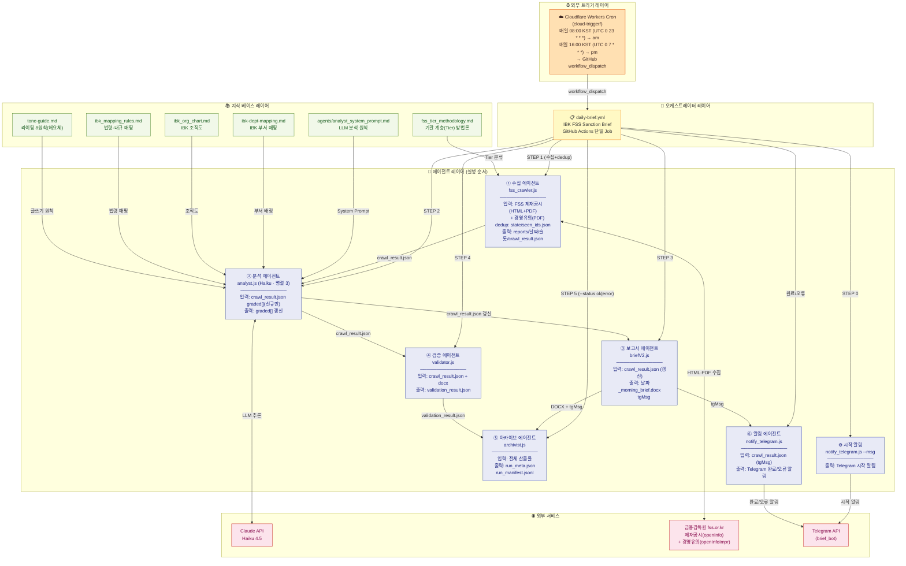
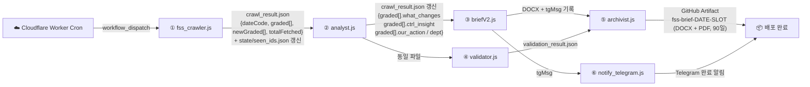

# 에이전트 조직도

> 단일 GitHub Actions Job을 구성하는 6개 클라우드 에이전트의 역할, 위계, 데이터 인계 관계
> (완전 클라우드 — 로컬 PC 불필요 · 도메인: 금융감독원(FSS) 제재·경영유의 사후 벤치마킹)

---

## 에이전트 계층도



---

## 실행 트리거 (완전 클라우드)

| 항목 | 내용 |
|---|---|
| 정시 트리거 | 외부 Cloudflare Workers Cron (`cloud-trigger/`) — 매일 **08:00 KST** (UTC cron `0 23 * * *` → am 슬롯)·**16:00 KST** (UTC cron `0 7 * * *` → pm 슬롯) 2회 |
| 트리거 방식 | GitHub `workflow_dispatch` 호출 (08:00 → am 슬롯 전체 알림 / 16:00 → pm 슬롯 델타 알림, 신규 0건 시 '변동 없음' 마감) |
| 백업 | 없음 — GitHub schedule cron은 지연·누락으로 **제거**(백업으로도 두지 않음) |
| 수동 | `gh workflow run "IBK FSS Sanction Brief" --ref main` |
| 워크플로우 | `.github/workflows/daily-brief.yml` (단일 Job) |

> 수집은 **FSS 2소스 순수 스크래핑**(제재공시 HTML+PDF / 경영유의 PDF)으로 클라우드에서 직접 실행한다.
> ✅ FSS는 해외 IP 차단이 없음이 검증됐다(`diag-fss-access.yml` PASS) → KR 프록시·OPEN API 계층 불요. GitHub Actions 러너에서 직결.
> 과거 FSC 프로젝트의 로컬 `telegram_listener.js`·`trigger_bot`(EXECUTE 릴레이)·공유 그룹·KR 프록시는 이 프로젝트에 없다.

---

## 에이전트별 상세 명세

### ⓪ notify_telegram.js — 시작 알림 (STEP 0)

**위치:** GitHub Actions (ubuntu-latest)

| 항목 | 내용 |
|---|---|
| 런타임 | Node.js |
| 동작 | `--msg "⚙️ {DATE} 브리핑 생성 시작합니다."` |
| 출력 | Telegram 시작 알림 |

---

### ① fss_crawler.js — 수집 에이전트 (STEP 1)

**위치:** GitHub Actions (ubuntu-latest) — 클라우드 직접 실행 (한국 IP 불필요)

| 항목 | 내용 |
|---|---|
| 런타임 | Node.js (CommonJS) |
| 입력 | FSS 제재공시 목록(`openInfo/list.do?menuNo=200476`) + 경영유의 목록(`openInfoImpr/list.do?menuNo=200483`) |
| dedup | `state/seen_ids.json` (제재=`examMgmtNo_emOpenSeq`, 경영유의=파일명 선두 ID) |
| 출력 | `reports/DATE/SLOT/crawl_result.json`, `reports/DATE/SLOT/raw/*.html`, `reports/DATE/SLOT/pdfs/*.pdf` |
| 재시도 | Job 레벨 최대 3회 |
| 실패 처리 | 실패 시 `failure_meta.json`만 기록 — 성공본(`crawl_result.json`)·ledger 비파괴(실패 격리) |

**핵심 알고리즘 — Tier 분류 × 제재강도 등급:**
```
Tier: T0 IBK / T1 은행(저축은행 제외) / T2 인접금융 / T3 주변(제외 대상)
score = 은행·유사업권 대상(+2) + 사유가 IBK 핵심업무(+2) + 제재강도(+1) ; IBK 직접 = 최상
등급: 상(score≥4) / 중(score≥2) / 하(score≥1) / 미해당(score=0, 제외)
알림 = T0·T1·T2 전건(T3 제외) / 보고서 = 전건 포함
```
> 제재·경영유의는 시행일·의견마감(D-day) 개념이 없다. 중요도는 **기관 계층 × 제재강도**로 판정한다(정본 `knowledge/fss_tier_methodology.md`).

---

### ② analyst.js — 분석 에이전트 (STEP 2)

**위치:** GitHub Actions (ubuntu-latest)

| 항목 | 내용 |
|---|---|
| 런타임 | Node.js (CommonJS) |
| 모델 | claude-haiku-4-5-20251001 (`MAX_TOKENS=2048`) |
| 입력 | crawl_result.json 의 `graded[]` — **crawler가 seen_ids로 걸러낸 신규 건만** |
| 처리 방식 | **소규모 병렬 (`CONCURRENCY=3`)** — 직렬 병목 회피 (Haiku RPM 여유 내) |
| 시스템 프롬프트 | `agents/analyst_system_prompt.md` + `knowledge/`(tone-guide 등) 동적 주입. 문체 **해요체** |
| 종료 코드 | 0=정상 / 1=fallback / 2=치명중단 |
| fallback | API 키 없거나 오류 시 키워드 기반 템플릿으로 대체 |

**LLM이 생성하는 필드:**

| 필드 | 의미 |
|---|---|
| `what_changes[]` | 제재 핵심 (해요체, 최대 2개) |
| `ctrl_insight` | IBK 유사업무 + 재발위험 (해요체) |
| `our_action[]` | 점검 제안 (부서명 + 해요체, 최대 3개) |
| `dept` / `related_depts` | IBK 공식 조직도 부서명 |
| `risk_grade` | RED/ORANGE/GREEN → 상/중/하 (grade로 승격) |
| `workflow_type` | 위반유형 A~F |
| `tg_key` / `term` | 알림 키(20자 이하) / 용어 해설 |

---

### ③ briefV2.js — 보고서 에이전트 (STEP 3)

**위치:** GitHub Actions (ubuntu-latest)

| 항목 | 내용 |
|---|---|
| 런타임 | Node.js (docx 라이브러리) |
| 입력 | crawl_result.json (analyst 갱신 후) |
| 출력 | `reports/DATE/SLOT/DATE_{morning\|afternoon}_brief.docx` + crawl_result.json 에 `tgMsg` 기록 |
| 폰트 위계 | 맑은 고딕 5단계 — 제목 18pt / 제재대상 헤더 13pt / 오프닝 11pt / 본문·라벨 10pt / 캡션 9pt |

**항목 카드 (전 건 동일 구조):**

| 요소 | 내용 |
|---|---|
| 제목 | "⚖️ 오늘의 제재·경영유의 브리핑" |
| 제재대상 | 기관명 · 계층(Tier) · 일자 (상=빨강, 그 외=IBK블루) |
| 무슨 일이 있었나요? | what_changes |
| IBK에도 발생 가능한가요? | ctrl_insight (재발 가능성) |
| 무엇을 점검할까요? | our_action (점검 제안) |

**tgMsg (질문형 2계층):** 헤더 `🔔 FSS 제재·경영유의 브리핑` + 제재대상 → `왜 제재를 받았나요?` / `IBK에서도 발생 가능한가요?` / `이런 부분을 점검하시면 좋아요` (질문 불릿 + 답변 들여쓰기 2계층). 알림 대상은 T0~T2, T3는 제외.

---

### ④ validator.js — 검증 에이전트 (STEP 4)

**위치:** GitHub Actions (ubuntu-latest)

| 항목 | 내용 |
|---|---|
| 런타임 | Node.js |
| 입력 | crawl_result.json + 생성된 docx |
| 출력 | `reports/DATE/SLOT/validation_result.json` |
| 종료 코드 | 0=통과 / 1=경고(계속) / 2=오류 |

**검증 그룹 (A~D):**

| 그룹 | 내용 |
|---|---|
| **A. 톤 8원칙** | A1 핵심 선행 · A2 문장 길이(what_changes 120자·our_action 200자) · A3 금지 표현 · A4 독자 주어(상/중 부서 명시) · A7 동사 종결 · **A7b 해요체("요" 종결)** · A8 즉시검토 평어 금지. (A6 D-day는 제재 도메인에 **미적용**) |
| **B. 절삭 검사** | B1 what_changes · B2 our_action(하등급은 INFO) · B3 summary/bodyText 최소 길이 · B4 ctrl_insight 존재 |
| **C. tgMsg 검증** | C0 출처·존재 · C1 글자 수(info) · C2 줄 수(info) · C3 시나리오별 필수 라벨 · C4 영향 없음 형식 |
| **D. 보고서 구조** | D1 헤더 · D2 요약 오프닝 · D3 항목 카드(제재대상/무슨 일/무엇을 점검) · D4 "IBK에도 발생 가능한가요?" · D5 마감요약(조건부) · D6 용어 · D7 마무리 — docx 실측 대조 |

---

### ⑤ archivist.js — 아카이브 에이전트 (STEP 5)

**위치:** GitHub Actions (ubuntu-latest), `--status {ok|error}`

| 항목 | 내용 |
|---|---|
| 런타임 | Node.js |
| 입력 | 전체 산출물 (DOCX, JSON, 로그) |
| 출력 | run_meta.json, run_manifest.jsonl 누적 |
| 보관 정책 | DOCX 90일 / JSON 30일 / 로그 14일 |

---

### ⑥ notify_telegram.js — 알림 에이전트 (완료/오류)

**위치:** GitHub Actions (ubuntu-latest)

| 항목 | 내용 |
|---|---|
| 런타임 | Node.js |
| 메신저 | Telegram (봇 1개 — brief_bot) |
| 완료 알림 | `--from-crawl-result` — crawl_result.json 의 `tgMsg` 발송 |
| 오류 알림 | 워크플로우 `if: failure()` → `--msg "❌ 브리핑 오류 발생 ({DATE}/{SLOT})..."` |
| 출력 | Telegram 완료/오류 알림 |

---

## 에이전트 간 데이터 인계 요약



---

_last updated: 2026-07-03 (오후 16:00 스케줄러 추가 — 하루 2회 발화 정합)_
