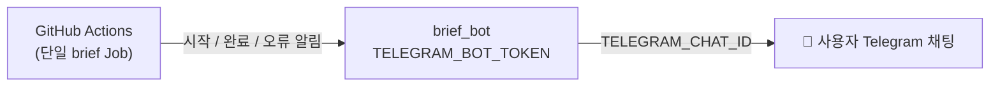
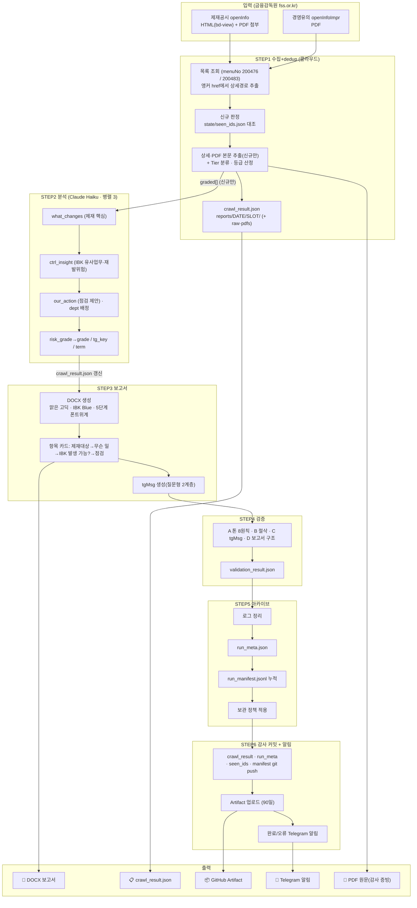

# 시스템 아키텍처

> IBK FSS 제재·경영유의 브리핑 파이프라인 — 전체 구조 및 데이터 흐름
> **완전 클라우드 자동화 — 로컬 PC 불필요**

금융감독원(FSS)이 게시하는 **제재공시·경영유의사항**을 수집해, 실제 제재사례 기반으로 IBK의 유사 업무를 **사후 벤치마킹·자가점검**하도록 돕는 브리핑이다.
(자매 프로젝트 FSC 입법예고 브리핑은 법령 변경을 미리 대응하는 **예방** 성격 — 이 프로젝트는 실제 제재를 사후 점검하는 **사후** 성격으로 목적이 다르다. 혼동 금지.)

---

## 전체 아키텍처 개요

```mermaid
flowchart LR
    subgraph TRIGGER["⏰ 트리거 (Cloudflare Workers Cron)"]
        CRON["Cloudflare Workers Cron\n매일 08:00 KST (UTC 0 23 * * *) → am\n매일 16:00 KST (UTC 0 7 * * *) → pm\n(cloud-trigger/)"]
    end

    subgraph CLOUD["☁️ GitHub Actions (ubuntu-latest · 단일 Job)"]
        direction TB
        DISPATCH["workflow_dispatch\ndaily-brief.yml (IBK FSS Sanction Brief)"]
        S0["STEP0 시작 알림\nnotify_telegram.js"]
        S1["STEP1 수집+dedup\nfss_crawler.js (2소스 스크래핑 · seen_ids)"]
        S2["STEP2 분석\nanalyst.js (Claude Haiku)"]
        S3["STEP3 보고서\nbriefV2.js (DOCX + tgMsg)"]
        S4["STEP4 검증\nvalidator.js"]
        S5["STEP5 아카이브\narchivist.js"]
        S6["STEP6 감사 커밋\nreports/{DATE}/{SLOT}/ · seen_ids · manifest"]
        ARTIFACT["📦 GitHub Artifact\nfss-brief-{DATE}-{SLOT} (90일)"]
        NOTIFY["📨 완료/오류 알림"]
        CLAUDE["🤖 Claude API\nHaiku 4.5"]
    end

    subgraph EXT["🌐 외부"]
        FSS["🏛️ 금융감독원 fss.or.kr\n제재공시(openInfo, HTML+PDF)\n경영유의(openInfoImpr, PDF)"]
        TG["📱 Telegram\nbrief_bot → 사용자 채팅"]
    end

    CRON -->|"workflow_dispatch 호출"| DISPATCH
    DISPATCH --> S0 --> S1
    S1 -->|"해외 IP 차단 없음 — GitHub Actions 직결(프록시 불요)"| FSS
    S1 --> S2
    S2 <-->|"LLM 추론"| CLAUDE
    S2 --> S3 --> S4 --> S5 --> S6
    S6 --> ARTIFACT
    S0 -->|"시작 알림"| TG
    S6 --> NOTIFY
    NOTIFY -->|"완료/오류 알림"| TG

    classDef trig fill:#FFF8E1,stroke:#F9A825,color:#E65100
    classDef cloud fill:#E3F2FD,stroke:#1565C0,color:#0D47A1
    classDef ext fill:#FFF3E0,stroke:#E65100,color:#BF360C

    class CRON trig
    class DISPATCH,S0,S1,S2,S3,S4,S5,S6,ARTIFACT,NOTIFY,CLAUDE cloud
    class FSS,TG ext
```

전 과정이 클라우드(Cloudflare Workers + GitHub Actions)에서 실행되며 로컬 PC는 필요하지 않다.
수집·분석·보고서·검증·아카이브·알림이 **단일 GitHub Actions Job** 안에서 순차 실행되고,
산출물은 **런별 슬롯(am/pm)** 으로 `reports/{DATE}/{SLOT}/` 에 분리 보존된다.
> ✅ **FSS는 해외 IP 차단이 없음이 검증됐다**(미국 러너 4종 접근 PASS · `diag-fss-access.yml`). 따라서 KR 경유 프록시나 OPEN API 계층 없이 **GitHub Actions 러너에서 fss.or.kr에 직결**해 순수 스크래핑한다.

---

## 구성 요소별 역할

### 트리거 (Cloudflare Workers Cron)

| 구성 요소 | 역할 |
|---|---|
| Cloudflare Workers Cron (`cloud-trigger/`) | 매일 **08:00 KST**(UTC `0 23 * * *` → am 슬롯)·**16:00 KST**(UTC `0 7 * * *` → pm 슬롯) 2회 GitHub `workflow_dispatch` 호출. 정시성 책임 |

**왜 GitHub 자체 schedule cron이 아닌가?**
GitHub Actions의 schedule cron은 최대 약 11~12시간의 지연·누락이 확인되어 **제거**했다(백업으로도 두지 않음). 정시성은 외부 Cloudflare Workers Cron이 전담한다.
수동 실행은 `gh workflow run "IBK FSS Sanction Brief" --ref main`.

> FSS 제재·경영유의는 **하루 2회 발화**로 운영한다(결정 B — FSC Morning brief 동형 오전/오후 커버리지). **08:00 KST = am 슬롯**(전체 알림), **16:00 KST = pm 슬롯**(오전 이후 신규만 델타 알림; 신규 0건이면 '변동 없음 · 기존 점검 유지' 마감 알림). 슬롯 로직(`runslot.js`/워크플로우: KST `<12=am`, `≥12=pm`)이 두 정시 발화를 슬롯별로 갈라 `reports/{DATE}/{SLOT}/` 에 비파괴 공존시킨다. pm 델타는 `notify_telegram.js --delta-since reports/{DATE}/am/crawl_result.json` + `seen_ids` dedup로 구현된다.

---

### 클라우드 파이프라인 (GitHub Actions · 단일 Job)

`.github/workflows/daily-brief.yml`(워크플로우명 **`IBK FSS Sanction Brief`**), `ubuntu-latest`, 단일 `brief` Job. `on: workflow_dispatch` 트리거.

| STEP | 구성 요소 | 역할 |
|---|---|---|
| STEP 0 | `notify_telegram.js --msg` | 시작 알림 (Telegram) |
| STEP 1 | `fss_crawler.js` | **수집+dedup: FSS 2소스 직접 스크래핑**(제재공시 HTML+PDF / 경영유의 PDF), `state/seen_ids.json` 대조로 신규만 선별. Job 레벨 **최대 3회 재시도** |
| STEP 2 | `analyst.js` | Claude Haiku LLM 분석 (신규 `graded[]`만). exit 0=정상 / 1=fallback / 2=치명중단 |
| STEP 3 | `briefV2.js` | DOCX 보고서 생성 + `tgMsg` 기록 |
| STEP 4 | `validator.js` | 품질 검증 (validation_result.json) |
| STEP 5 | `archivist.js` | 로그 정리·메타 기록·보관 정책 적용 (`--status ok|error`) |
| STEP 6 | 감사 커밋 | `reports/{DATE}/{SLOT}/`(crawl_result·run_meta)·`state/seen_ids.json`·`run_manifest.jsonl` git 커밋·push |
| — | Artifact 업로드 | `reports/{DATE}/{SLOT}/` → `fss-brief-{DATE}-{SLOT}` (90일) |
| — | 완료/오류 알림 | `notify_telegram.js` (성공 시 `--from-crawl-result`로 tgMsg 전송 / 실패 시 오류 알림) |

**수집 방식 (2소스 순수 스크래핑):**
`fss_crawler.js` 단일 수집기가 다음 2개 소스를 HTML 앵커 href에서 상세경로를 추출해 직접 긁는다(추정 경로·하드코딩 없음).
1. **제재공시** — `https://www.fss.or.kr/fss/job/openInfo/list.do?menuNo=200476` (상세 HTML `bd-view` 메타 + 제재내용 PDF 첨부). dedup 키 = `examMgmtNo` + `_` + `emOpenSeq`.
2. **경영유의** — `https://www.fss.or.kr/fss/job/openInfoImpr/list.do?menuNo=200483` (상세페이지 없이 바로 PDF). dedup 키 = 첨부 파일명 선두 ID(예: `202600082_11`).

**신규 판별 — 게시일 앵커 + 중복방지 ledger (`state/seen_ids.json`):**
발행이 부정기적이고 목록엔 과거 공시가 누적 노출되므로, **"게시일(postDate) ≥ 앵커 `REPORT_SINCE`(기본 2026-07-02) AND 레저에 없던 건"** 만 신규로 보고한다. 앵커 이전 게시분('백로그')은 레저에만 등록해 재검토를 막고 알림·보고·상세수집에서 완전 제외한다(게시일 파싱 실패는 fail-open). 레저 부재만으론 오래된 공시가 '당일 신규'로 새던 문제를 앵커가 차단한다(총평단 2026-07-03 지적). 레저 `state/seen_ids.json`은 유일한 상태 저장소로 **성공 시에만** 커밋해 중복 알림(특히 08:00·16:00 두 실행 간)을 막는다. 최초 실행(ledger 빔)은 **시드 모드**로도 초기 범람을 막는다. crawl_result에 `backlogSkipped`·`reportSince` 기록.

**수집 실패 처리 (실패 격리):**
수집이 timeout/error로 최종 실패하면 "신규 없음"으로 오인 보고하지 않는다. 수집기는 `failure_meta.json`만 기록하고 **성공본(`crawl_result.json`)·ledger는 건드리지 않는다**. STEP 6는 이 신호로 커밋 대상을 갈라 기존 성공 기록을 보존하며, **"❌ 수집 실패"** 알림 후 Job을 실패(`exit 1`)로 중단한다.

**스캔 증적 (`crawl_result.scanAudit`):** 매 페이지에서 본 **목록 key 전체 + 본문 SHA-256 해시**(page·url·status·rowCount 포함)를 기록한다. 신규 0건(noUpdate)이어도 남고 `crawl_result.json`과 함께 **git 영구 커밋**되므로, 원본 목록 HTML(`raw/`, Artifact 90일)이 만료돼도 "그날 게시판에서 무엇을 스캔했는지"를 항구 증적할 수 있다(일단위 감사 대응).

---

### 외부 서비스

| 서비스 | 용도 |
|---|---|
| 금융감독원 fss.or.kr | **수집 원천** — 제재공시(openInfo, HTML+PDF)·경영유의(openInfoImpr, PDF) 순수 스크래핑. 해외 IP 차단 없음(직결) |
| Telegram API | 시작·완료·오류 알림 발송 (단일 봇) |
| Anthropic Claude API | Haiku 4.5 LLM 추론 (analyst.js) |

> FSC 프로젝트에서 쓰던 정부입법지원센터 OPEN API·금융위 fsc.go.kr fallback·KR 경유 프록시(Vercel icn1)는 **이 프로젝트에 존재하지 않는다**(FSS는 차단이 없어 불필요).

---

## 중요도 판정 — 기관 계층(Tier) × 제재강도

제재·경영유의는 시행일·의견마감(D-day) 개념이 **없다**. 대신 **제재대상 기관의 계층(Tier)** 과 **제재강도**로 IBK 벤치마킹 우선순위를 정한다. 정본은 `knowledge/fss_tier_methodology.md`.

| Tier | 대상 | 알림 |
|---|---|---|
| **T0** | IBK 직접(기업은행·중소기업은행·IBK) | 포함 |
| **T1** | 은행(저축은행 제외 · 인터넷전문은행 포함) | 포함 |
| **T2** | 인접 금융업권(저축은행·금융지주·보험·증권·자산운용·신탁·카드·캐피탈·여신전문 등) | 포함 |
| **T3** | 주변·비은행(환전영업소·대부·소액송금·판매대리점(GA)·P2P·조합 등) | **제외**(보고서에는 수록) |

- **Telegram 알림 = T0·T1·T2 전건** (T3 제외).
- **DOCX 보고서 = 전건 포함**(T3 포함, 참고용).
- 제재강도(과징금·기관경고·영업정지·문책경고 등)는 등급(상/중/하) 산정에 가산된다. IBK 직접 건은 최상(상).

---

## Telegram 알림 구조 (단일 봇)

봇은 **1개**만 사용한다. 동일 봇이 시작 알림(STEP 0)·완료 알림(`--from-crawl-result`)·오류 알림을 사용자 채팅(`TELEGRAM_CHAT_ID`)으로 발송한다. 알림 메시지 본문 필드명은 **`tgMsg`**이며 `crawl_result.json`에 기록된다.

**tgMsg 구조** — 헤더 `🔔 금융감독원 제재·경영유의 브리핑 (HH:MM)` + 알림 대상(T0~T2) 각 건을 다음 **질문형 라벨 + 질문·답변 2계층**으로 표시한다.
- `제재대상: {기관명} [{계층}]` (일자·유형 메타)
- `왜 제재를 받았나요?` → 답변(what_changes)
- `IBK에서도 발생 가능한가요?` → 답변(ctrl_insight, 재발위험·부서)
- `이런 부분을 점검하시면 좋아요` → 답변(our_action)

신규가 없으면 "✅ 신규 제재·경영유의 없음 — 기존 점검 유지", 신규가 전부 T3면 "IBK 유관 없음"으로 마감한다.

---

## 데이터 흐름 상세

---

## 보고서(DOCX) 구조

제목 **"⚖️ 오늘의 제재·경영유의 브리핑"** 아래, 전 건이 동일한 **항목 카드** 구조를 따른다.

`제재대상(기관·계층·일자)` → `무슨 일이 있었나요?` → `IBK에도 발생 가능한가요?` → `무엇을 점검할까요?`

**폰트 위계 (맑은 고딕, 5단계):** 제목 18pt / 제재대상 헤더 13pt / 오프닝 11pt / 본문·라벨 10pt / 캡션(계층·일자·유형) 9pt.

---

## 환경 변수 및 Secrets

### GitHub Actions Secrets (3개)

| Secret | 용도 |
|---|---|
| `ANTHROPIC_API_KEY` | Claude Haiku API 키 (analyst.js) |
| `TELEGRAM_BOT_TOKEN` | brief_bot 토큰 (시작·완료·오류 알림 발송) |
| `TELEGRAM_CHAT_ID` | 사용자 Telegram 채팅 ID (알림 수신) |

### Cloudflare Worker Secret

| Secret | 용도 |
|---|---|
| `GH_PAT` | Cloudflare Workers Cron이 GitHub `workflow_dispatch`를 호출할 때 쓰는 PAT (`cloud-trigger/` 측 관리) |

---

## 알려진 제약사항

| 제약 | 원인 | 대응 |
|---|---|---|
| GitHub schedule cron 정시성 부족 | 최대 ~11~12h 지연·누락 | Cloudflare Workers Cron으로 08:00 KST(`0 23 * * *`)·16:00 KST(`0 7 * * *`) 2회 트리거 |
| 발행 부정기 → 과거 누적 공시가 '당일 신규'로 오인 | 목록에 과거 공시 누적 노출 | **게시일 앵커(`REPORT_SINCE`)로 백로그 차단** + `state/seen_ids.json` dedup ledger(성공 시에만 커밋), 최초 시드 모드로 초기 범람 차단 |
| 수집 timeout·일시장애 | 외부 응답 지연 | STEP1 Job 레벨 최대 3회 재시도, 최종 실패 시 "❌ 수집 실패" 알림 + Job 실패(`failure_meta.json` 격리, 성공본 비파괴) |
| DOCX git 추적 부담 | 보관/용량 정책 | GitHub Artifact(90일) 다운로드 방식으로 제공 |

---

_last updated: 2026-07-03 (오후 16:00 스케줄러 추가 — 하루 2회 발화 정합)_
