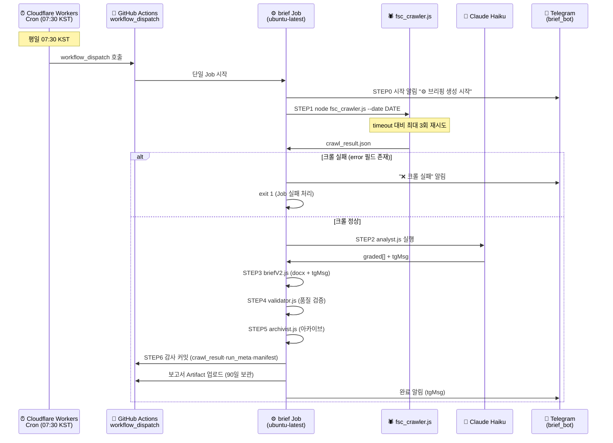

# 일별 워크플로우

> IBK 아침 규제 브리핑 파이프라인 — 단계별 실행 절차 (완전 클라우드)

표시 규칙:  
🤖 = 완전 자동  
🖐 = 수동 개입 필요  
⚠️ = 이슈 발생 시 수동 확인

> **아키텍처 요약:** 크롤부터 알림까지 전부 GitHub Actions 단일 Job에서 실행된다. 로컬 PC는 불필요하다. FSC가 해외 IP를 차단하지 않음이 검증되어(미국 러너에서 크롤 정상) 크롤도 클라우드에서 직접 수행한다.

---

## 일별 실행 흐름 (정상 경로)



---

## 단계별 상세 절차

### Phase 1 — 사전 준비 (최초 1회만)

| 단계 | 작업 | 자동화 |
|---|---|---|
| 1-1 | GitHub Secrets 등록 (3개: `ANTHROPIC_API_KEY` · `TELEGRAM_BOT_TOKEN` · `TELEGRAM_CHAT_ID`) | 🖐 |
| 1-2 | Cloudflare Workers Cron 배포 (`cloud-trigger/`) — 07:30 KST `workflow_dispatch` 트리거 | 🖐 |
| 1-3 | Telegram 봇(brief_bot / @briefcoworkbot) 생성 + 사용자 채팅 `TELEGRAM_CHAT_ID` 확보 | 🖐 |

> 로컬 클론(`npm install`, `.env`, Task Scheduler 등)은 더 이상 운영에 필요하지 않다. 개별 단계를 수동 디버깅할 때만 선택적으로 사용한다.

---

### Phase 2 — 매일 자동 실행 (정상 경로)

#### Step 1 🤖 트리거 (07:30 KST)

```
Cloudflare Workers Cron (07:30 KST 발화)
  → GitHub workflow_dispatch 호출 (IBK Morning Brief)
  → brief Job (ubuntu-latest) 시작
```

> **왜 Cloudflare인가:** GitHub 자체 schedule cron은 ~12h 지연·누락이 확인되어 제거했다. 정시성은 외부 Cloudflare Workers Cron이 책임진다. Worker 코드는 `cloud-trigger/` 폴더에 있다.

#### Step 2 🤖 단일 클라우드 Job (07:30~07:34)

```
brief Job (.github/workflows/daily-brief.yml, ubuntu-latest):
  STEP0  시작 알림 (Telegram)           — node notify_telegram.js --msg "⚙️ … 시작"
  STEP1  크롤                            — node fsc_crawler.js --date DATE  (최대 3회 재시도)
  STEP2  분석 (Claude Haiku)             — node analyst.js --date DATE      (exit 0=정상/1=fallback/2=치명)
  STEP3  보고서 (docx + tgMsg)           — node briefV2.js --date DATE
  STEP4  검증                            — node validator.js --date DATE    (exit 0=통과/1=경고/2=오류)
  STEP5  아카이브                        — node archivist.js --date DATE --status ok|error
  STEP6  감사 커밋 + push                 — crawl_result.json · run_meta.json · run_manifest.jsonl
  Artifact 업로드 (docx + PDF, 90일 보관)
  완료 알림 (Telegram, tgMsg)            — node notify_telegram.js --from-crawl-result
```

> **왜 크롤도 클라우드인가:** FSC가 해외 IP를 차단하지 않음이 미국 러너에서 검증되었다. 한국 IP(로컬)가 필요 없어 크롤까지 같은 Job에서 실행한다.

#### Step 3 🤖 크롤 실패 처리 (예외 경로)

```
fsc_crawler.js를 최대 3회(120초 간격) 재시도해도 crawl_result.json 에 error 필드가 남으면:
  → node notify_telegram.js --msg "❌ … 크롤 실패 …"   (명시적 실패 알림)
  → exit 1                                            (Job 실패 처리)
```

> **왜 중요한가:** 크롤 timeout/error를 "IBK 영향 없음"으로 오인 보고하지 않기 위함이다. 데이터 미확인 시 반드시 실패로 처리하고 재실행을 유도한다.

---

### Phase 3 — 결과 확인 (팀원)

| 확인 항목 | 방법 | 자동화 |
|---|---|---|
| Telegram 완료 알림 수신 | 스마트폰 알림 (brief_bot) | 🤖 |
| DOCX 보고서 열람 | Actions 탭 → Artifacts → `morning-brief-DATE` | 🖐 |
| PDF 원문 확인 | Artifact 내 `reports/DATE/` (감사·검증 시) | 🖐 |
| 검증 결과 확인 | Artifact 내 `validation_result.json` | ⚠️ 경고 시만 |
| 원시 수집 데이터 | git 커밋된 `reports/DATE/crawl_result.json` | 🖐 (감사 시) |

---

## 수동 실행

### GitHub Actions 수동 실행 (권장)

```powershell
gh workflow run "IBK Morning Brief" --ref main
```

또는 GitHub → Actions → IBK Morning Brief → Run workflow.

### 개별 단계 수동 실행 (로컬 디버깅 시)

```powershell
cd D:\projects\ibk-morning-brief

node fsc_crawler.js --date 20260625              # 크롤러만
node analyst.js --date 20260625                  # 분석만 (ANTHROPIC_API_KEY 필요)
node briefV2.js --date 20260625                  # 보고서만
node validator.js --date 20260625                # 검증만
node archivist.js --date 20260625 --status ok    # 아카이브만
```

---

## 오류 대응 절차

### 케이스 1: "❌ 크롤 실패" 알림

```
1. GitHub → Actions → 실패한 실행 → STEP 1 로그 확인 (3회 시도 모두 timeout/error)
2. FSC 사이트(https://www.fsc.go.kr/po040301) 가용성 확인
3. gh workflow run "IBK Morning Brief" --ref main 으로 재실행
```

### 케이스 2: "❌ 브리핑 오류 발생" 알림

```
1. GitHub → Actions → 실패한 실행 → 로그 확인
2. ANTHROPIC_API_KEY Secret 유효 여부 확인
3. Run workflow(또는 gh workflow run)로 재실행
4. analyst exitCode=1은 fallback 모드 (정상 계속), exitCode=2만 치명 중단
```

### 케이스 3: 정시(07:30)에 실행이 트리거되지 않음

```
1. Cloudflare Workers Cron 상태 확인 (cloud-trigger/ — 대시보드 로그)
2. workflow_dispatch 권한·토큰 만료 여부 확인
3. 임시로 gh workflow run "IBK Morning Brief" --ref main 으로 수동 트리거
```

---

## 타임라인 요약 (평일)

| 시각 | 이벤트 | 주체 |
|---|---|---|
| 07:30 | Cloudflare Workers Cron 발화 → workflow_dispatch 호출 | 🤖 클라우드 |
| 07:30 | brief Job 시작 → STEP0 시작 알림 (Telegram) | 🤖 클라우드 |
| 07:30~31 | STEP1 fsc_crawler.js (크롤, 최대 3회 재시도) | 🤖 클라우드 |
| 07:31~33 | STEP2~3 analyst.js → briefV2.js (분석 + docx) | 🤖 클라우드 |
| 07:33~34 | STEP4~6 validator → archivist → 감사 커밋 → Artifact | 🤖 클라우드 |
| 07:34 | 완료 알림 수신 (Telegram, tgMsg) | 🤖 클라우드 |
| 07:34~ | 팀원 DOCX 열람 (Actions Artifacts) | 🖐 팀원 |

> 단일 클라우드 Job 전체 소요 시간은 약 2~4분이다.

---

_last updated: 2026-06-25_
