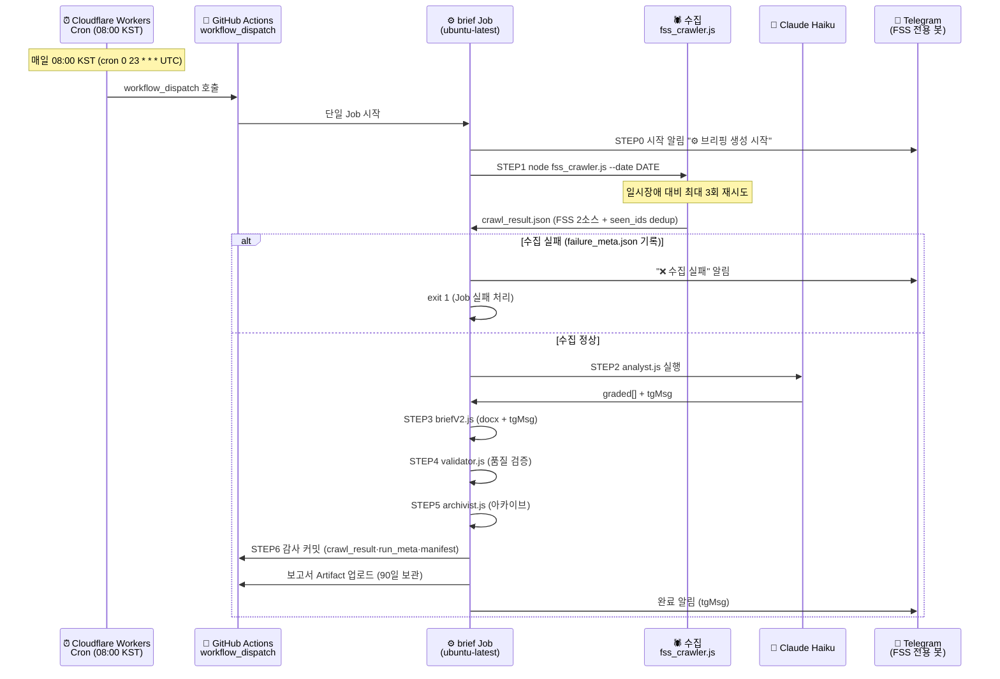

# 일별 워크플로우

> IBK FSS 제재·경영유의 브리핑 파이프라인 — 단계별 실행 절차 (완전 클라우드)
> 이 문서는 루트 [workflow.md](../workflow.md)(현행 요약)의 **단계별 상세** 편이다. 개념·포맷은 루트를, 실행 절차·타임라인·오류 대응은 이 문서를 본다.

표시 규칙:  
🤖 = 완전 자동  
🖐 = 수동 개입 필요  
⚠️ = 이슈 발생 시 수동 확인

> **아키텍처 요약:** 수집부터 알림까지 전부 GitHub Actions 단일 Job에서 실행된다(로컬 PC 불필요). 수집은 **금융감독원(FSS) 2소스 직접 스크래핑**(제재공시 openInfo HTML+PDF / 경영유의 openInfoImpr PDF) + `state/seen_ids.json` dedup. 산출물은 런별 슬롯(am/pm)으로 분리 보존.
> ✅ FSS는 해외 IP 차단이 없어(미국 러너 접근 PASS, `diag-fss-access.yml`) **KR 프록시·OPEN API·FSC fallback 없이 직결 스크래핑**한다. 콜드스타트·일시장애는 재시도로 흡수한다.

---

## 일별 실행 흐름 (정상 경로)



---

## 단계별 상세 절차

### Phase 1 — 사전 준비 (최초 1회만)

| 단계 | 작업 | 자동화 |
|---|---|---|
| 1-1 | GitHub Secrets 등록 (3개: `ANTHROPIC_API_KEY` · `TELEGRAM_BOT_TOKEN` · `TELEGRAM_CHAT_ID`) | 🖐 |
| 1-2 | Cloudflare Workers Cron 배포 (`cloud-trigger/`) — 08:00 KST(cron `0 23 * * *`) `workflow_dispatch` 트리거 + secret `GH_PAT` | 🖐 |
| 1-3 | Telegram 봇(FSS 전용 신규 봇, FSC 법령 알림과 채널 분리) 생성 + `TELEGRAM_CHAT_ID` 확보 | 🖐 |

> 로컬 클론(`npm install`, `.env`, Task Scheduler 등)은 더 이상 운영에 필요하지 않다. 개별 단계를 수동 디버깅할 때만 선택적으로 사용한다.

---

### Phase 2 — 매일 자동 실행 (정상 경로)

#### Step 1 🤖 트리거 (08:00 KST)

```
Cloudflare Workers Cron (08:00 KST = 23:00 UTC, cron 0 23 * * * 발화)
  → GitHub workflow_dispatch 호출 (IBK FSS Sanction Brief)
  → brief Job (ubuntu-latest) 시작 (발화시각 KST로 슬롯 판별: <12=am)
```

> **왜 Cloudflare인가:** GitHub 자체 schedule cron은 ~11h 지연·누락이 확인되어 제거했다. 정시성은 외부 Cloudflare Workers Cron이 책임진다. Worker 코드는 `cloud-trigger/` 폴더에 있다.

#### Step 2 🤖 단일 클라우드 Job (발화 후 ~4분)

```
brief Job (.github/workflows/daily-brief.yml, ubuntu-latest):
  STEP0  시작 알림 (Telegram)           — node notify_telegram.js --msg "⚙️ … 시작"
  STEP1  수집 (FSS 2소스 직접 스크래핑)  — node fss_crawler.js --date DATE  (최대 3회 재시도, 120초 간격)
  STEP2  분석 (Claude Haiku)             — node analyst.js --date DATE      (exit 0=정상/1=fallback/2=치명)
  STEP3  보고서 (docx + tgMsg)           — node briefV2.js --date DATE
  STEP4  검증                            — node validator.js --date DATE    (exit 0=통과/1=경고/2=오류)
  STEP5  아카이브                        — node archivist.js --date DATE --status ok|error
  STEP6  감사 커밋 + push                 — crawl_result.json · run_meta.json · run_manifest.jsonl · state/seen_ids.json
  Artifact 업로드 (fss-brief-DATE-slot, 90일 보관)
  완료 알림 (Telegram, tgMsg)            — node notify_telegram.js --from-crawl-result
```

> **수집 방식:** FSS 2소스 직접 스크래핑 — ① 제재공시 `openInfo`(목록 HTML → 상세, 본문 PDF) ② 경영유의·개선 `openInfoImpr`(목록 → 첨부 PDF). 전체 목록 수집 후 `state/seen_ids.json`에 없는 것만 신규로 채택.
> ✅ FSS는 해외 IP 차단이 없어(diag-fss-access.yml PASS) KR 프록시·OPEN API·FSC fallback 없이 러너에서 **직결** 스크래핑한다. 재시도는 egress 우회가 아니라 콜드스타트·일시장애 흡수용이다.

#### Step 3 🤖 수집 실패 처리 (예외 경로)

```
fss_crawler.js를 최대 3회(120초 간격) 재시도해도 성공하지 못하면:
  → failure_meta.json만 기록(성공본 crawl_result.json은 비파괴 보존)
  → node notify_telegram.js --msg "❌ … 수집 실패 …"   (명시적 실패 알림)
  → Job 실패 처리(if: failure() 오류 알림)
```

> **왜 중요한가:** 수집 실패를 "IBK 영향 없음"으로 오인 보고하지 않기 위함이다. 데이터 미확인 ≠ 안전. 실패 시 성공본을 덮지 않고 `failure_meta.json`으로 격리한 뒤, 반드시 실패로 처리하고 재실행을 유도한다.

---

### Phase 3 — 결과 확인 (팀원)

| 확인 항목 | 방법 | 자동화 |
|---|---|---|
| Telegram 완료 알림 수신 | 스마트폰 알림 (FSS 전용 봇) | 🤖 |
| DOCX 보고서 열람 | Actions 탭 → Artifacts → `fss-brief-DATE-slot` | 🖐 |
| 수집 원본 확인 | Artifact 내 `reports/DATE/slot/` (감사·검증 시) | 🖐 |
| 검증 결과 확인 | Artifact 내 `validation_result.json` | ⚠️ 경고 시만 |
| 원시 수집 데이터 | git 커밋된 `reports/DATE/slot/crawl_result.json` | 🖐 (감사 시) |

---

## 수동 실행

### GitHub Actions 수동 실행 (권장)

```powershell
gh workflow run "IBK FSS Sanction Brief" --ref main
```

또는 GitHub → Actions → IBK FSS Sanction Brief → Run workflow.

### 개별 단계 수동 실행 (로컬 디버깅 시)

```powershell
cd D:\projects\ibk-FSS-brief

node fss_crawler.js --date 20260625              # 수집만 (FSS 2소스 직접 스크래핑 + seen_ids dedup)
node analyst.js --date 20260625                  # 분석만 (ANTHROPIC_API_KEY 필요)
node briefV2.js --date 20260625                  # 보고서만
node validator.js --date 20260625                # 검증만
node archivist.js --date 20260625 --status ok    # 아카이브만
```

---

## 오류 대응 절차

### 케이스 1: "❌ 수집 실패" 알림 (FSS 직결 스크래핑 실패)

```
1. GitHub → Actions → 실패한 실행 → STEP 1 로그 + failure_meta.json 확인 (3회 시도 모두 실패한 사유)
2. FSS는 해외 IP 차단이 없어 러너에서 직결한다(프록시 없음). 실패 사유를 계층으로 좁힌다:
   - FSS 사이트 개편/구조 변경으로 목록·상세 파싱 실패(selector·menuNo) → fss_crawler.js 파서 점검
   - 첨부 PDF 다운로드/파싱(pdf-parse) 실패 → 해당 소스만 재시도
   - 일시 네트워크 오류(콜드스타트·5xx) → 대개 재실행으로 해소
3. 실패해도 성공본(crawl_result.json)은 비파괴 보존되고 failure_meta.json만 기록된다(오인 보고 차단).
4. gh workflow run "IBK FSS Sanction Brief" --ref main 으로 재실행
```

### 케이스 2: "❌ 브리핑 오류 발생" 알림

```
1. GitHub → Actions → 실패한 실행 → 로그 확인
2. ANTHROPIC_API_KEY Secret 유효 여부 확인
3. Run workflow(또는 gh workflow run)로 재실행
4. analyst exitCode=1은 fallback 모드 (정상 계속), exitCode=2만 치명 중단
```

### 케이스 3: 정시(08:00 KST)에 실행이 트리거되지 않음

```
1. Cloudflare Workers Cron 상태 확인 (cloud-trigger/ — 대시보드 로그, cron 0 23 * * * UTC)
2. workflow_dispatch 권한·Worker secret GH_PAT 만료 여부 확인
3. 임시로 gh workflow run "IBK FSS Sanction Brief" --ref main 으로 수동 트리거
```

---

## 타임라인 요약 (매일 08:00 KST 1회 — 정시 슬롯 am)

| 시각(KST) | 이벤트 | 주체 |
|---|---|---|
| 08:00 | Cloudflare Workers Cron 발화 → workflow_dispatch (정시 슬롯 am) | 🤖 클라우드 |
| +0분 | brief Job 시작 → STEP0 시작 알림 (Telegram) | 🤖 클라우드 |
| +0~1분 | STEP1 수집 (FSS 2소스 직결 스크래핑 + seen_ids dedup, 최대 3회 재시도) | 🤖 클라우드 |
| +1~3분 | STEP2~3 analyst.js(Haiku 병렬 CONCURRENCY=3) → briefV2.js (분석 + docx) | 🤖 클라우드 |
| +3~4분 | STEP4~6 validator → archivist → 감사 커밋(seen_ids 포함) → Artifact | 🤖 클라우드 |
| +4분 | 완료 알림 (신규 IBK 유관 있을 때 상세 / 없으면 "IBK 유관 없음") | 🤖 클라우드 |
| 이후 | 팀원 DOCX 열람 (Actions Artifacts) | 🖐 팀원 |

> 정시 08:00 발화는 단일 슬롯(am)이다. 수동으로 오후에 재실행하면 슬롯이 pm으로 자동 분리돼 오전 기록을 덮지 않는다. 단일 클라우드 Job 전체 소요 시간은 약 2~4분이다.

---

_last updated: 2026-07-02 (FSS 현행 구현 기준 갱신)_
